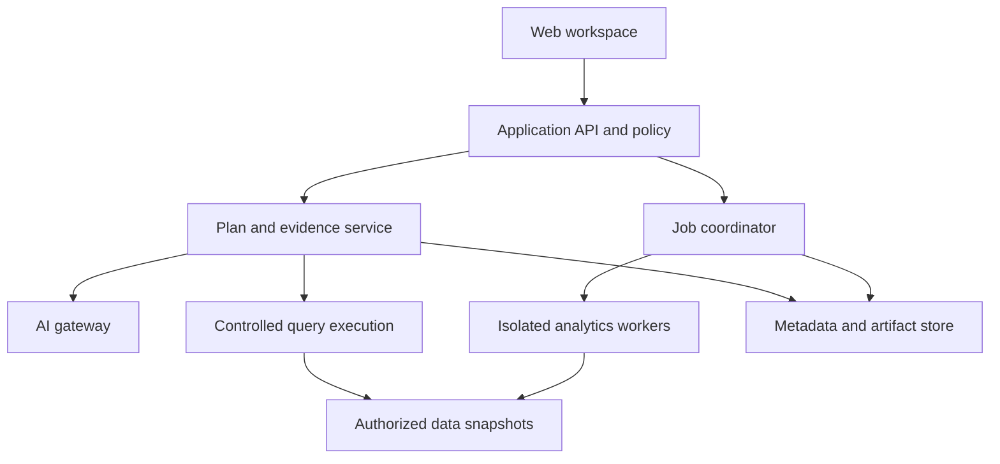

# DecisionOS — Master Business and Technical Specification

**Version:** 3.0 — consolidated and corrected design baseline  
**Prepared:** 15 September 2026  
**Inputs reviewed:** `IDEA.md` (621 lines) and `RESEARCH.md` (5,118 lines; research v2)  
**Audience:** Founder, product owner, engineering, analytics, design, QA, security, implementation partners, and prospective design partners  
**Working name:** DecisionOS; trademark, company-name, and domain availability have not been checked.

> Connect operational data, establish its business meaning, investigate changes, compare practical decisions, and measure outcomes—with evidence and uncertainty attached to each claim.

This is a new, consolidated specification that supersedes conflicting recommendations in the two inputs. It preserves their product ambition, corrects consequential errors, and fills business and engineering gaps. The original inputs remain source documents. This specification is not a claim that software has been implemented, statistical models have been validated on customer data, or regulatory approval has been obtained.

## Contents

1. Document rules and executive decisions
2. Source audit and correction register
3. Product thesis, positioning, and competitive reality
4. Customers, jobs, and business validation
5. Commercial model and economics
6. Product scope and capability maturity
7. User experience and navigation
8. Data connection, ingestion, and publication
9. Data understanding, quality, and transformation
10. Semantic definitions and metric execution
11. Search, conversations, and investigations
12. Findings, claims, evidence, and reproducibility
13. Dashboards, visualizations, and reports
14. Monitoring, incidents, and alerts
15. Workflow and process intelligence
16. Forecasting and predictive risk
17. Scenarios, optimization, and simulation
18. Causal evaluation and experiments
19. Decision briefs, register, and organizational memory
20. Actions and controlled automation
21. Architecture and technology decisions
22. Data model and integrity requirements
23. API, event, and job contracts
24. Security, identity, authorization, and isolation
25. Privacy, residency, retention, and procurement
26. AI gateway, model governance, and cost controls
27. Arabic, English, accessibility, and formatting
28. Reliability, operations, performance, and recovery
29. Quality engineering and acceptance tests
30. Delivery roadmap, work packages, and effort model
31. Onboarding, support, and adoption
32. Risks, assumptions, and decision gates
33. End-to-end worked example
34. Coverage map and implementation handoff
35. Sources and verification status

---

## 1. Document rules and executive decisions

### 1.1 Meaning of requirements

- **MUST:** required for a capability to be released.
- **SHOULD:** default recommendation; an exception needs a recorded technical or product rationale.
- **MAY:** optional capability.
- **Verified external fact:** supported by a linked primary source; date-sensitive facts must be rechecked before procurement or implementation.
- **Design decision:** a proposed architecture or product rule, not a universal fact.
- **Planning target:** an initial measurable target that needs benchmarking or customer validation.
- **Hypothesis:** an unproven commercial or behavioral assumption.

All prices, schedules, resource limits, minimum sample rules, and adoption thresholds in this document are **planning assumptions unless explicitly described otherwise**. Numerical precision does not make an assumption evidence.

### 1.2 Executive decisions

| ID | Decision | Why | Revisit condition |
|---|---|---|---|
| ED-01 | Build a general analytical foundation with an operational workflow product first | Provides a coherent business problem and reusable core | Another domain demonstrates materially stronger demand and data access |
| ED-02 | Use governed, typed analytical plans for production answers | Limits ambiguity and supports shared calculations | Extend the language when validated customer questions require it |
| ED-03 | Keep arbitrary generated SQL and code outside the initial production surface | A parser and prompt cannot constitute the security boundary | Dedicated isolated analyst capability passes security and correctness gates |
| ED-04 | Use immutable dataset manifests and pinned semantic releases | A timestamp watermark cannot reproduce overwritten data | Retention or privacy policies require restricted reproduction |
| ED-05 | Treat authorization as an end-to-end runtime control | A previously valid answer can become unauthorized after a role change | Never relaxed; implementation can evolve |
| ED-06 | Separate execution status, evidence type, and quality status | Refusal is not a scientific evidence category | Schema additions must preserve separation |
| ED-07 | Build scenario templates around actual customer decisions | Avoids a generic modeling tool that operators cannot use | Repeated demand justifies custom models |
| ED-08 | Preserve the decision history but make it exportable | Customers should retain their own knowledge | Never use data lock-in as the business case |
| ED-09 | Select technology through measured fit, maintainability, support, and licensing | The original weighted matrices contain arithmetic and framing errors | Review at each material scale or contract change |
| ED-10 | Release through correctness, security, and customer-value gates | Feature completion alone does not establish usefulness | Gate thresholds may be calibrated; failures must remain visible |

### 1.3 Product principles

1. Every displayed business number comes from a controlled computation or an explicitly attributed manual input.
2. An explanation must preserve metric, segment, time window, comparison, and evidence—not merely repeat an allowed number.
3. An unknown remains unknown; do not invent a distribution, confidence percentage, cause, or counterargument.
4. A prediction, an assumed scenario, and a causal effect are separate artifacts.
5. Data corrections create traceable revisions. Historical conclusions can be withdrawn without rewriting what was originally known.
6. Permissions apply to previews, search, model inputs, caches, findings, exports, notifications, and actions.
7. A useful first release is narrow in domain and complete in its end-to-end behavior.
8. The full vision remains in scope across stages; later capabilities are not disguised as already available.

## 2. Source audit and correction register

### 2.1 Overall assessment

`IDEA.md` has a sound product direction: business meaning, evidence, scenarios, and outcome tracking. `RESEARCH.md` adds substantial coverage but presents some illustrative code and assumptions with more confidence than they deserve. Its claim that the design is buildable as written is not supported by the supplied DDL, algorithms, or calculations.

The audit below concerns the supplied v2. Its historical claims about a separate v1 were not independently verified because that v1 was not supplied. Source locations use the original section names to avoid ambiguous numbering.

### 2.2 Business, legal, and architecture corrections

| ID | Source location | Problem | Replacement in this specification |
|---|---|---|---|
| C-01 | ES.1; Areas 9–10; competitive analysis | “No incumbent owns the loop,” “no BI tool has decision memory,” and “the loop is not copyable” are unsupported | Aera explicitly markets decision memory; Celonis has process simulation and actions. Differentiation is a customer hypothesis, not absence of competition. [S01–S03] |
| C-02 | ES.3 L1; Area 3 | “No off-the-shelf product does this” is not established by the comparison table | Run a build-versus-adapt spike against the actual governed-metric requirements; own the approval UX if useful, reuse infrastructure where economical |
| C-03 | Areas 9–10 | A few previous decisions automatically form a reliable reference class | Compare only sufficiently similar, adequately documented decisions; account for selection and attribution limitations |
| C-04 | Area 10.8 | Switching platforms necessarily loses decision history | Supply tested open-format exports and stable identifiers; compete on ongoing usefulness |
| C-05 | Compliance §3.5.1 | Bahrain PDPL is named Law No. 3 of 2018 | Correct to **Law No. 30 of 2018**. [S04] |
| C-06 | Compliance §3.5 | Generic seven-year retention, regulatory approvals, procurement durations, and certificate schedules read as defaults | Create a customer-specific obligations register. No blanket GCC rule or universal deadline is asserted |
| C-07 | Compliance §3.5.5 | Audit logs are equated with records of processing | Maintain a separate processing-activities register; audit events are supporting evidence |
| C-08 | Compliance §3.5.5 | Destroying a tenant key is suggested for erasing one person | Tenant-key destruction can erase all tenant data; selective deletion requires targeted object rewrite or suitable key granularity |
| C-09 | Compliance §3.5.2 | Offshore hosting plus masking is treated as if PII cannot leave | Ingestion, backups, logs, support, embeddings, inference, and subprocessors all count in the data-flow assessment |
| C-10 | Area 11.5 | AGPL service boundaries are treated as a categorical legal conclusion | Review the actual version, modifications, integration, distribution, and terms. A subprocess is neither automatic exemption nor automatic whole-product disclosure. [S05–S06] |
| C-11 | Technology shortlist | ydata-profiling is characterized as LGPL; Terraform generically as MPL; tooling is broadly called permissive | Verify exact distributions and licenses. ydata documentation identifies MIT; HashiCorp announced BUSL adoption. Do not copy the old license table. [S07–S08] |
| C-12 | Backend options | Lucia is suggested as a maintained authentication package | Remove that recommendation; Lucia states it was deprecated in March 2025. Use maintained authentication components selected for the chosen backend. [S09] |
| C-13 | Area 11.5 | Reimplementing Inductive/Heuristics miners is assumed to be the best commercial choice | Start with event aggregations, directly-follows views, and rule conformance. Compare licensed software versus independent implementation on total ownership cost |
| C-14 | Area 12 | Python is described as technically non-negotiable; other backends categorically dismissed | Python is the recommended analytics ecosystem, not a logical requirement. Default to the founder’s Nuxt/Laravel stack plus Python workers, with clear ownership |
| C-15 | Delivery/technology | Tenant count alone triggers Kubernetes, GPU, or a warehouse | Use measured concurrency, memory, scan cost, isolation, recovery, and service objectives |
| C-16 | Area 12 L2 | Customer-source pushdown is described as inherently impossible to scope | It can be constrained with curated views and permissions; copied-data execution is a chosen default, with reviewed live-query mode as an option |

### 2.3 Analytical and data corrections

| ID | Source location | Problem | Replacement |
|---|---|---|---|
| C-17 | Area 7.5 | MASE denominator uses holdout SeasonalNaive error | MASE uses mean absolute lagged differences in each training fold. A holdout model/baseline error ratio is a separate metric. [S10] |
| C-18 | Area 7.5 | Coverage helper receives `0.80` but expects `80`; missing quantiles can yield zero loss | One interval representation; missing bounds are unsupported, never perfect performance |
| C-19 | Area 7.5 | Model class names and TSB constructor are not a dependable current API example | Pin dependencies and compile/run integration examples; do not transplant this code. Official source contains `HistoricAverage` and `RandomWalkWithDrift`. [S11] |
| C-20 | Area 7.4 | “Two weekly cycles” is equated with 56 daily points; annual cycles also conflict | Separate seasonal period, observed cycles, fold feasibility, and empirical history policy |
| C-21 | Area 7.4 | Fixed 500-positive and 10-events-per-variable rules are universal refusal gates | Use model complexity, event count, representativeness, evaluation precision, learning curves, and decision cost; heuristics are not universal laws |
| C-22 | Area 7.4 | Survival is refused below 5% censoring | Uncensored data remain valid duration data; absence of censoring is not itself a refusal reason |
| C-23 | Area 7.7 | `1 - S(target)` is labeled risk of missing the target | For time-to-completion, late risk is `S(target)`; for a case open at age `e < target`, use `S(target)/S(e)` under the model’s assumptions. [S12] |
| C-24 | Area 7.2 | Backlog is classified exclusively as survival | Backlog is a stock-flow problem; arrivals, exits, transfers, age structure, and capacity matter. Survival is one possible component |
| C-25 | Area 7.8 | Error ratio mechanically widens intervals | Recalibrate using appropriate residuals or predictive distributions and re-evaluate coverage; do not assert nominal coverage after arbitrary widening |
| C-26 | Area 7; forecast DDL | MASE and forecast bands are required for classification and survival | Use discriminated model-run payloads and class-appropriate metrics |
| C-27 | Area 8.4 | Concavity variables omit time and are not correctly linked to allocated hours; capacity can be reused across periods | Use period-indexed segments, an hours-equality constraint, and a valid concave capacity formulation |
| C-28 | Area 8.4 | Overtime can be double-charged; backlog cap is called an SLA | Separate regular and overtime hours/costs. Model deadline cohorts or call a backlog cap a proxy |
| C-29 | Area 8.5 | Initial backlog, unfinished cases, WIP limit, and warm-up are absent from the shown simulation | Include these explicitly; a completed-only sample understates delay near the horizon |
| C-30 | Area 8.5 | Same seed guarantees correctly paired options and narrower intervals | Separate random streams by event type/entity; variance reduction is possible, not guaranteed |
| C-31 | Area 8 | Percentiles required even when no defensible probability model exists | Show deterministic outputs and sensitivity ranges when appropriate; label probabilistic quantiles only when supported |
| C-32 | Area 8 | Infeasibility automatically comes with binding constraints; timeout always has a feasible solution | Distinguish infeasibility diagnostics from binding constraints; check incumbent existence, feasibility, bound, and optimality gap |
| C-33 | Area 10.4 | ITS uses `t*D` and labels the intervention coefficient as immediate level change | Use `(t-t0)*D` so the coefficient on `D` is the level change at intervention |
| C-34 | Areas 8–10 | A causal-design row or design name grants causal confidence | Require executed study, assumptions, diagnostics, uncertainty, and appropriate review; design existence is insufficient |
| C-35 | Area 9 | Numeric-token whitelist is called sufficient to stop plausible wrong answers | Validate full claim bindings; a correct number attached to the wrong branch remains wrong |
| C-36 | Area 9 | Mandatory nonempty counterevidence conflicts with “none detected” | Allow `detected`, `not_detected`, `not_testable`, and `not_run`, with coverage and evidence |
| C-37 | Area 6.4 | Detection fits over the scored series, drops time gaps, and leaves expected values inconsistent after driver adjustment | Use causal-in-time training windows, regular time grids, explicit missingness, and internally consistent predictions/residuals |
| C-38 | Area 6.5 | Distribution change and zero rows can automatically suppress real business incidents | Separate ingestion integrity from genuine business movement; use source reconciliation and dependency-specific health |
| C-39 | Area 11.4 | Sorting timestamps before checking negative differences cannot detect business-order violations | Compare original semantic milestones and expected transitions before temporal sorting |
| C-40 | Area 11.4 | Snapshot diffs provide a complete event log | They provide interval-censored observed changes and can miss intermediate states and loops |
| C-41 | Area 11.4 | Little’s Law residual proves incomplete data | It can also reflect transient conditions, boundary mismatch, censoring, or inconsistent averaging; use it as a diagnostic |
| C-42 | Area 2.3 | Grain confirmation checks duplicates but not null key components; candidate combinations are unbounded | Check both exactly, cap candidate search, and distinguish key uniqueness from business grain |
| C-43 | Area 2.2 | Ambiguous dates/time zones may be silently chosen because a sampled metric changes little | Never approve high-consequence semantics from a sample-only materiality result; preserve lexical source values |
| C-44 | Areas 2, 6 | Content hashes are treated as universal event deduplication keys | Identical legitimate events may coexist. Require source event identity or documented ambiguity; an upsert needs a version/order policy |
| C-45 | Area 2.2.6 | Minimum of batch and stream watermarks establishes consistency | Incomparable or inactive offsets cannot be minimized. Use source-specific checkpoints and an atomic published manifest |
| C-46 | Areas 2, 12 | Deterministic object keys and overwrites imply exactly-once publication and history retention | Use immutable attempt paths, atomic manifest publication, checkpoint transactions, and idempotent commit keys |
| C-47 | Area 2.2 | Byte-identical Parquet is required for reproducibility | Distinguish binary integrity from equivalent canonical data; encodings, metadata, ordering, and engine changes affect bytes |
| C-48 | Area 4.6 | Definition and data changes can be uniquely attributed using two runs | Use four combinations and name the decomposition order; interactions can make attribution path-dependent |

### 2.4 Security, schema, UI, and planning corrections

| ID | Source location | Problem | Replacement |
|---|---|---|---|
| C-49 | SQL validator §3.2.4 | Global CTE-name skipping does not implement lexical scope and may skip physical relations | Use engine-aware scope resolution; do not use the snippet as a production validator |
| C-50 | SQL validator §3.2.4 | LIMIT modification may target a copied AST or one side of a set operation; post-check does not establish isolation | Validate and limit the actual execution root; enforce execution resource limits independently |
| C-51 | SQL validator §3.2.4 | Denylists, parser re-emission, and EXPLAIN are treated as security guarantees | Strict supported-language allowlists plus privileged separation and engine/OS controls; reject unsupported parser nodes |
| C-52 | Area 3 compiler | A fanout warning or acknowledgment permits an inflated sum | Pre-aggregate, use semijoins/bridge weights, or refuse; acknowledgment cannot make incorrect arithmetic correct |
| C-53 | Caching sections | Several cache keys omit the user’s effective data permissions, source revision, and disclosure policy | One canonical scoped key with permission epoch, snapshot set, semantic release, parameters, versions, and disclosure policy |
| C-54 | Area 4; dashboard links | Sensitive filters serialized in URLs leak through history/referrers/logs | Use opaque server-side saved-state IDs; reauthorize on open |
| C-55 | DDL Appendix B | Missing `users`, invalid expression in table UNIQUE, missing `btree_gist`, omitted triggers, and placeholders make “full DDL” non-executable | Publish a logical model and enforceable schema patterns; implementation migrations must pass a clean-database gate |
| C-56 | DDL Appendix B | Single-column foreign keys do not enforce tenant consistency | Composite tenant-scoped references and workspace containment constraints |
| C-57 | DDL Appendix B | Approval uniqueness does not prevent overlapping version publications; `max(version)+1` races | Stable definition identity, serialized version allocation, immutable content and transactional publication intervals |
| C-58 | Alert DDL | Unique `(tenant, dedupe_key, fired_at)` permits duplicate alerts | Deduplicate the event/episode identity independently of firing timestamp |
| C-59 | AI-call DDL | `date_trunc` on `timestamptz` in an index depends on timezone | Index `(tenant_id, created_at)` or use a deliberately immutable UTC expression after validation |
| C-60 | Area 3; API | Inclusive end dates are unclear at timestamp precision | Use half-open instant windows `[start,end)` with explicit business timezone |
| C-61 | Localization §3.3 | Vue I18n is presented as directly accepting ICU messages | Use supported native plural rules or an explicitly tested custom ICU compiler. [S13] |
| C-62 | Localization §3.3 | U+2066 is named FSI, locale extensions concatenated, and date formatting omits timezone | U+2066 is LRI, U+2068 FSI; use structured locale options and explicit timezone |
| C-63 | Localization/chart adapter | `structuredClone` of ECharts options can fail on functions; CSS mirroring a canvas cannot reliably counter-mirror labels | Generate options from data-only ChartSpec; implement and test chart-specific direction |
| C-64 | Search | PostgreSQL built-in FTS is called BM25 | Describe actual `ts_rank`/`ts_rank_cd` lexical ranking; use a verified BM25 implementation only if selected. [S14] |
| C-65 | Quality | Supported-question refusal counts as success; 95% target conflicts with every digest failure blocking | Report supported-answer coverage, answered correctness, and refusal precision separately |
| C-66 | Delivery §3.6.2 | Work-package sums and stage totals are wrong | Supplied rows total **180 engineering + 131 validation = 311**. Stages 0–2 total **222**, and stages 0–4 total **293**, in the document’s stated person-week unit |
| C-67 | Delivery §3.6.5 | Calendar estimates use incorrect workload totals | Listed roles total **5.3**, which is correct; the related stage arithmetic uses incorrect workload totals. At 70% utilization, 222/3.71 ≈ **59.8 weeks**, not 34 |
| C-68 | Technology weighted matrices | Several scores do not match their stated weights | Recalculate: backend A PHP-fluent **4.10**, B **4.20**; Postgres **3.90**, DuckDB+Postgres **3.95**; process-mining PM4Py **3.30**, commercial SDK **4.35** |
| C-69 | First-product scope | SLA-risk scoring promised before the forecasting stage; survival engine lacks its own work package | Separate rules-based age flags from validated predictive risk; add a distinct survival package |
| C-70 | Risk contingencies | Auto-approval of definitions and auto-closing overdue decisions hide unresolved work | Provisional remains visibly provisional; overdue decisions remain overdue or are explicitly abandoned |

These are design and source-review findings. The supplied snippets have not been executed as a complete application. The corrected formulas, arithmetic, and document consistency are checked separately during preparation; a production implementation still needs the release evidence in Section 29.

## 3. Product thesis, positioning, and competitive reality

### 3.1 The problem

Operational teams already have systems of record. They struggle to connect inconsistent data and business definitions to timely decisions. Reports describe symptoms; investigations lose context; scenario assumptions are hidden; actions are disconnected from measurement; staff reconstruct prior reasoning from messages and spreadsheets.

DecisionOS should reduce the effort between identifying a problem and reviewing the result of an action. The product is strongest when the decision repeats, the outcome is measurable, and the organization can supply useful data.

### 3.2 Positioning

**Proposed category:** Operational decision intelligence.

**Initial positioning:** An evidence-based workspace for teams managing queues, applications, tickets, approvals, and service delivery.

**Buyer promise:** Understand where work is delayed, inspect the evidence, compare feasible responses, and follow the results.

**Do not promise:** universal dataset comprehension, guaranteed business improvement, perfect forecasting, automatic causality, zero setup, zero competition, or fully autonomous operation from day one.

### 3.3 Competitive assessment

| Competitor/category | Verified overlap or established evaluation area | Implication |
|---|---|---|
| Aera Decision Cloud | Vendor describes capturing decisions, context, actions, outcomes, and decision memory. [S01] | Decision history and a closed loop alone are not unique |
| Celonis | Vendor describes process simulations, predictions, what-if analysis, and Action Flows. [S02–S03] | Process-to-action capabilities overlap materially |
| Power BI Copilot | Natural-language analysis depends on prepared business/semantic context. [S15] | Chat and dashboards are expected capabilities |
| ThoughtSpot, Tableau, Sigma, Hex | Relevant products to evaluate with real workflows; no unsupported feature absence asserted here | Use scripted trials rather than checkmark guesses |
| Planning products | Relevant for driver modeling, budgets, and scenarios | Customers may already own a solution for part of the job |
| Existing analysts plus Excel/SQL | The practical incumbent for many teams | Demonstrate less effort and greater traceability without forcing wholesale replacement |

Vendor pages verify that vendors market these capabilities; they do not prove comparative quality, pricing, implementation effort, or adoption in Bahrain.

### 3.4 Defensible advantage hypothesis

A credible advantage could combine:

- Domain-specific onboarding and approved operational definitions.
- High-quality Arabic/English analysis over local business terminology.
- Transparent data, assumptions, and result revision histories.
- Practical workflow scenarios with visible trade-offs.
- Deployment and data-control choices appropriate to the buyer.
- Shorter time to a verified decision than the customer’s existing process.
- Reusable domain packs developed with explicit rights to reuse generic patterns.

Each is testable. None is inherently impossible for an incumbent to copy. Customer trust, implementation efficiency, distribution, and repeatable value matter more than claiming a unique feature list.

### 3.5 Expansion strategy

Begin with service operations. Later packs may cover insurance administration, procurement approvals, customer onboarding, inventory exceptions, and project delivery. Each pack must define its entities, events, metrics, questions, data requirements, scenario assumptions, and evaluation fixtures.

Do not hardcode BKIC or BBK business rules into the platform. Do not assume access to their data, permission to reuse their configurations, or their actual schema. Use synthetic examples until authorized data is available.

## 4. Customers, jobs, and business validation

### 4.1 Ideal initial customer profile

A candidate has repeated operational decisions, a named process owner, sufficiently accessible data, a measurable service problem, and willingness to validate definitions and answers. Organization size is a screening aid, not the core criterion.

| Persona | Daily job | Product value | Success measure |
|---|---|---|---|
| Operations manager | Review queues, allocate work, address delays | Prioritized issues and feasible options | Faster issue-to-decision cycle; service performance |
| Analyst | Reconcile data, answer questions, explain changes | Governed reusable queries and evidence | Fewer repeated manual reconciliations |
| Process owner | Improve flow and reduce rework | Process views, experiments, outcome tracking | Measured improvement with counter-metrics |
| Data steward | Resolve meaning, quality, and ownership | Contracts, definition approvals, impact analysis | Fewer ambiguous or broken metrics |
| Executive sponsor | Choose investments and review results | Concise decision briefs and history | Verified value and adoption |
| IT/security | Control integration, identity, and exposure | Auditable deployment and access controls | Successful security and operational acceptance |

### 4.2 Jobs to be done

- When a KPI changes, determine whether the change is real before escalating it.
- When a queue grows, identify likely contributors and cases needing attention.
- When deciding between interventions, see cost, uncertainty, constraints, and counter-effects together.
- When presenting a recommendation, show exactly what evidence supports each claim.
- When a decision is due for review, compare the expectation with observed outcomes using compatible definitions.
- When a data source changes, understand which reports and decisions are affected.

### 4.3 Validation sequence

1. Interview approximately 12–15 relevant buyers/operators as an initial research target, including prospects that reject the idea.
2. Ask for the last three real decisions, their supporting data, time spent, and consequences—not opinions about “AI.”
3. Inspect a de-identified sample and the current report/decision workflow.
4. Identify a single recurring decision with a named owner and baseline.
5. Offer a scoped paid diagnostic or pilot; willingness to pay is stronger evidence than enthusiasm.
6. Build independently verified answers to representative questions.
7. Observe use for at least one complete decision-and-review cycle.
8. Compare repeat usage, effort, costs, and willingness to renew.

### 4.4 Qualification and rejection

Reject or postpone a pilot with no authorized data access, no owner, no decision the team can change, no measurable outcome, or an expectation that the system invent missing history. A dashboard-only request can be served with a narrower product, but it does not validate the decision-intelligence thesis.

### 4.5 Product metrics

Define all denominators and observation windows:

- **Time to first verified answer:** from approved data readiness to accepted result; separately report time from contract signature.
- **Supported-answer coverage:** answered supported questions divided by all supported questions.
- **Answered correctness:** correct answers divided by answers actually supplied on the evaluated set.
- **Decision review completion:** reviewed eligible decisions divided by decisions due, excluding explicitly cancelled reviews.
- **Actionable alert precision:** reviewed alerts confirmed useful divided by reviewed alerts; also report unreviewed rate.
- **Decision cycle time:** issue detection to documented choice; separate implementation delay.
- **Verified value:** accepted operational or financial benefit under a declared evaluation method.
- **Retention:** active paying workspaces and renewals; usage is not a substitute for payment.

Do not optimize the number of decisions recorded or alerts fired. Those can increase while the product becomes less useful.

## 5. Commercial model and economics

### 5.1 Packaging hypothesis

| Package | Intended scope | Charging basis |
|---|---|---|
| Data readiness diagnostic | Source assessment, question set, feasibility, remediation | Fixed scoped service fee |
| Operational workspace | Governed analysis, dashboards, search, findings, decisions | Base subscription with bounded usage |
| Advanced decision package | Validated predictions, approved scenario templates, evaluations | Higher subscription or domain-pack add-on |
| Enterprise deployment | SSO, dedicated/private infrastructure, support commitments | Contracted subscription plus deployment/support fee |
| Additional integration | Connector/mapping beyond supported templates | Scoped implementation fee and maintenance terms |

Do not sell “unlimited” compute, storage, users, or support without explicit fair-use limits. Do not make logo rights, reference calls, or reuse of customer patterns automatic conditions disguised as standard product access.

### 5.2 Price discovery

The old USD price table was not validated market research. Treat it as discarded pricing hypotheses. Test several offers against the buyer’s problem, substitute costs, procurement limits, support burden, and willingness to pay. Quote BHD or the buyer’s contract currency with taxes, overage caps, renewal terms, and included support explicitly defined.

A free pilot can be justified for strategic learning, but should have a bounded scope, expiry, named sponsor, data-readiness deadline, and conversion decision. Paid onboarding and a free product trial can coexist only when that distinction is clear.

### 5.3 Economic model

Use these formulas:

- Recurring gross profit = subscription revenue − direct recurring delivery costs.
- Direct recurring costs = analytics compute + application infrastructure + storage/backups + AI + network + licensed components + support labor + allocated operational coverage.
- Onboarding contribution = onboarding fee − implementation labor − customer-specific tools/travel − allocated review costs.
- CAC payback months = acquisition cost / monthly recurring gross profit from the acquired cohort, when positive.
- Runway months = available cash / monthly net cash burn; account for collection timing and commitments.

**Illustrative arithmetic only, not a recommended price or cost forecast:**

| Item | Example per workspace/month, BHD |
|---|---:|
| Subscription revenue | 600 |
| Compute, database, storage, backups | 70 |
| AI usage | 20 |
| Support: 6 hours at loaded cost 20/hour | 120 |
| Allocated operations/security/licensing | 40 |
| Total direct recurring costs | 250 |
| Gross profit | 350 |
| Gross margin | 58.3% |

At 12 support hours, direct costs become 370 BHD and margin becomes 38.3%. At 3 support hours, direct costs become 190 BHD and margin becomes 68.3%. This sensitivity matters more than assuming a small token bill guarantees high margins.

Illustrative onboarding: 80 hours × 20 BHD plus 200 BHD other direct cost = 1,800 BHD delivery cost. A 2,400 BHD fee yields 600 BHD contribution, or 25%, before corporate overhead. Measure actual hours rather than treating onboarding as free R&D.

### 5.4 Market sizing and sales motion

Use a bottom-up model: eligible organizations × accessible segment × qualified accounts × plausible conversion × annual contract value. Do not invent a Bahrain market count or extrapolate a global AI market report into attainable revenue.

Sales steps: qualify problem → inspect data → diagnostic → scoped pilot → acceptance → renewal/expansion. Track reasons for loss: no budget, no data, incumbent sufficient, security requirements, poor accuracy, or weak operational ownership.

Pilot success can be a reason to stop expanding a module if users do not act on it. High ambition requires disciplined evidence about what buyers value.

## 6. Product scope and capability maturity

### 6.1 Capability map

| Module | Foundation/reliable release | Operational release | Advanced release |
|---|---|---|---|
| Data workspace | CSV/XLSX and one SQL source; profiling; versioned publication | Scheduled APIs, approved connectors, drift handling | CDC, reviewed live queries, warehouse connections |
| Definitions | Metrics, entities, relationships, calendars, aliases, approval | Impact analysis, reusable domain packs | Complex cohort/temporal semantics and federation |
| Analysis | Typed plans, supported question templates, evidence | Saved investigations, contribution analysis | Isolated advanced analyst workspace |
| Dashboards | Curated charts, filters, drill-down, exports | Operational templates and scheduled reports | Specialized statistical and scenario views |
| Monitoring | Freshness and ingestion incidents | Contextual alerts and owner workflows | Adaptive thresholds and coordinated incident investigations |
| Workflow | Basic case/queue metrics if inputs support them | Variants, stage elapsed time, rule conformance | Object-centric models and selected discovery/conformance engines |
| Prediction | Explicit unavailable state | Rules-based overdue/age signals | Validated time-series, classification, survival, backlog forecasts |
| Decisions | Manual/drafted decision records and evidence links | Briefs, review reminders, outcome measurements | Scenario comparisons, experiments, reference classes |
| Actions | Save, assign, comment, notify within platform | Approved external task handoff if integrated | Governed writeback and bounded policy automation |
| Enterprise | Baseline security, MFA, backups, audit | Contract-driven SSO and dedicated deployment | SCIM, richer SIEM, residency variants, advanced controls |

SSO and essential security cannot be delayed until a nominal stage if a pilot requires them. Conversely, no customer needs every enterprise feature automatically.

### 6.2 Capability availability

Each workspace exposes a capability registry with: `not_configured`, `available`, `limited`, `degraded`, `suspended`, or `not_supported`. An unavailable forecast explains the missing input or validation step. The UI must never display invented preview predictions as live results.

### 6.3 Exploration versus certification

- **Exploration:** provisional definitions and analyst-created calculations are allowed within access policy, visibly labeled, with provenance.
- **Certified reporting:** uses approved semantic releases and tested calculations.
- **Decision publication:** requires declared evidence, assumptions, and applicable approvals.

Exploration does not silently promote a definition. Approved cleaning rules may run automatically on later imports within their validated scope; each execution records the rule version and service actor. This avoids asking the same approval on every refresh while retaining control.

## 7. User experience and navigation

### 7.1 Main pages

| Page | Main content | Primary actions | Important states |
|---|---|---|---|
| Overview | Priority findings, goal progress, data health | Investigate, review, open dashboard | New workspace, no findings, stale source |
| Data | Connections, datasets, readiness, snapshots | Connect, upload, profile, map, publish | Scanning, quarantined, partial, paused |
| Definitions | Approved/provisional definitions and lineage | Propose, compare, approve, retire | Conflict, pending approval, affected dependents |
| Explore | Search plus conversational analysis | Ask, filter, compare, pin, save | Clarification, unsupported, partial, denied |
| Dashboards | Role-appropriate views | Filter, drill, edit, export | Empty, stale, loading, scope changed |
| Investigations | Saved reasoning and evidence trail | Rerun, branch, compare, share | Definition drift, missing snapshot |
| Monitor | Business alerts and separate data incidents | Acknowledge, assign, investigate, resolve | Suppressed, flapping, notification failed |
| Process | Queue/case metrics, variants, conformance | Segment, inspect cases, identify bottleneck | Inferred timing, incomplete trace |
| Forecasts | Suitability, models, forecast performance | Configure, compare, publish, suspend | Insufficient history, drift, labels pending |
| Scenarios | Options, assumptions, constraints, outcomes | Clone baseline, solve, compare, validate | Infeasible, timeout, unknown uncertainty |
| Decisions | Proposals, active actions, due reviews | Accept, reject, amend, evaluate | Overdue, incomparable, abandoned |
| Reports | Reusable report templates and schedules | Preview, schedule, download | Recipient not authorized, job failure |
| Administration | Members, policies, budgets, integrations | Manage access and operating settings | Expired credentials, limit reached |

### 7.2 Core interaction rules

- A new workspace starts with data onboarding and a sample walkthrough; an established workspace can default to its work inbox.
- Every number shows unit and relevant period. Evidence and assumptions are one action away.
- Filters remain visible as chips. A changed scope is announced before interpreting a comparison.
- Large jobs show progress, cancellation, last heartbeat, and a durable result link.
- Preserve unsaved drafts during recoverable network failures without storing restricted raw data in browser persistence.
- Use clear empty states: “No completed cases in this period” differs from “The completion source did not refresh.”
- Keyboard navigation, accessible tables, and Arabic layout are baseline requirements.
- Use compact summaries with progressive detail. Technical diagnostics belong in evidence/admin views, not every operator workflow.

### 7.3 Collaboration

Findings and decisions support comments, mentions, assignments, and revision history. A comment is not an approved semantic change. Mentions and notifications must recheck recipient access. Shared links contain opaque identifiers; opening a link never grants access.

Support dashboard ownership transfer, user deactivation, and reassignment of open reviews. Deleting a user account must not destroy historical actor attribution required by the retention policy; use a retained minimal identity reference where permitted.

## 8. Data connection, ingestion, and publication

### 8.1 Connector contract

Every connector declares supported capabilities rather than pretending all sources behave identically:

- Authentication method and credential reference.
- Source objects and columns permitted for extraction.
- Full snapshot, append, upsert, or CDC semantics.
- Stable event/record identity and source ordering field, if available.
- Deletion and correction behavior.
- Snapshot consistency capabilities.
- Pagination, rate limits, retry rules, and source load limits.
- Schema introspection and type mapping.
- Supported checkpoint type: timestamp plus tie-breaker, opaque API cursor, log offset, or snapshot ID.
- Data classification and approved processing region.

Public APIs reference connector credentials; they do not return plaintext secrets. File parsing and SQL extraction happen in bounded workers, never inside the web request process.

### 8.2 File ingestion

MUST support a preview of detected sheets, header row, delimiter, encoding, data types, and parsing issues. Preserve the raw uploaded bytes until their authorized retention expires.

Controls include:

- File signature/MIME inspection; supported formats allowlist.
- Size, decompression, row, column, cell-length, memory, and runtime limits.
- Quarantine before scanning and parsing; do not imply antivirus detects every hostile file.
- No macro execution, external workbook links, formula execution, or arbitrary code.
- Explicit XLSX formula handling: distinguish formula text, cached value, missing cache, and stale/unknown recalculation state.
- Excel date system awareness, date-only values, and conversion policy; do not interpret every serial number as a date.
- Preserve identifiers and leading zeros. If Excel already removed digits or rounded a long identifier, report that the source cannot be faithfully recovered.
- Support UTF-8 and explicitly selected common legacy encodings; uncertain detection needs user confirmation.
- Detect merged headers, subtotal rows, multiple tables, hidden sheets, and duplicate column labels; propose mapping rather than silently flattening them.
- Record rejected rows separately with reasons and reconcile counts before publishing.

CSV/XLSX exports must neutralize spreadsheet formula injection according to an explicit export policy, while preserving an authorized machine-readable export option when needed.

### 8.3 SQL extraction

Use source-specific read-only credentials scoped to curated views/tables. Set query timeouts, connection caps, fetch batch sizes, and scheduling limits agreed with the source owner. Use consistent snapshots where supported. Otherwise record the consistency limitation and reconcile the result.

For timestamp increments, use a stable composite checkpoint such as `(updated_at, primary_key)` plus a documented overlap strategy; timestamp alone can skip tied records. Updates with old timestamps, hard deletes, or non-monotonic sources require CDC, tombstones, or periodic reconciliation. A rolling rescan is not a universal completeness guarantee.

Source views can hide unnecessary sensitive columns before extraction. Primary-source production load is an explicit acceptance criterion.

### 8.4 APIs and webhooks

- Validate destination hosts and protect connectors against SSRF, including redirects, DNS rebinding, metadata endpoints, and private-address access outside explicitly approved network routes.
- Webhook authentication uses a verified signature scheme, replay window, and secret rotation.
- Acknowledge only after durable acceptance; processing is asynchronous.
- Deduplicate by source event identity within the source/dataset namespace. Do not merge distinct events merely because their contents match.
- Record received time, source event time, ordering/version, and payload reference.
- Handle pagination-token expiry, 429 responses, backoff, partial pages, and schema changes.

### 8.5 Atomic publication

Use immutable dataset revisions and manifests:

1. Create an ingest run and attempt with a lease/heartbeat.
2. Capture extraction checkpoint and consistency metadata.
3. Write attempt objects to private immutable paths.
4. Run parsing, schema, row-count, key, and source-reconciliation checks.
5. Build a manifest listing exact object versions/hashes, schema, transform version, and checkpoints.
6. In one application transaction, publish the manifest pointer and the committed checkpoint using optimistic concurrency; emit an outbox event.
7. Queries resolve the published manifest once and pin it for the run.
8. Failed attempts remain unavailable to query execution and are cleaned according to retention.

A worker can die without running `finally`; an independent lease sweeper marks abandoned runs and schedules safe recovery. A successful object write is not the same as a committed dataset publication.

### 8.6 Updates, deletes, and restatements

An upsert defines how source versions win and how conflicts are recorded. A delete is represented by a tombstone or equivalent rewrite in a new manifest. Late corrections create a new revision even if the maximum event timestamp stays unchanged.

Multi-source analysis pins a **snapshot set** containing each source revision and its consistency status. If two systems have no shared transactional boundary, state that the combined result is not an atomic cross-system snapshot.

Retain old manifests and objects only within the retention policy. Do not promise perpetual reproduction after lawful erasure or expiry.

### 8.7 Streaming path

Move to CDC or a durable stream only when the use case and source support it. Preserve the same publication and provenance contracts. Record source offsets separately; do not take a numerical minimum across an LSN, a timestamp, and an API cursor.

A batch-to-CDC handoff needs a consistent initial snapshot, captured log position, overlap reconciliation, idempotent application, and a clear authority transition. PostgreSQL notifications may wake a worker; they are not the durable event ledger.

## 9. Data understanding, quality, and transformation

### 9.1 Profiling output

Every dataset profile includes schema, candidate semantic types, null rates, distinct counts, duplicate groups, value distributions, outlier candidates, date coverage, category changes, key candidates, relationship candidates, sensitive-field tags, and sample limitations.

Sampling must identify the method. A head sample can be biased by ordering. Use bounded reservoir/stratified sampling when appropriate and exact checks for publication-critical keys and reconciliation totals.

### 9.2 Grain and relationship confirmation

“Each row is unique” does not establish “each row is one application.” A table can have a surrogate row ID while representing application-document combinations.

For a proposed key, check every component for nulls and verify uniqueness over the complete committed candidate dataset. Then confirm its business meaning. Empty datasets cannot empirically prove a grain. Cap the number and width of key combinations inspected.

For relationships, record one-to-one/many-to-one/many-to-many, optionality, unmatched rate, temporal validity, expected coverage, and approved join path. Revalidate when either dataset changes. Never infer a join solely from similar column names.

### 9.3 Ambiguity handling

Classify ambiguities by consequence:

- **Blocking for certified use:** grain, monetary currency/unit, ambiguous date parsing, timestamp interpretation, join identity, unknown refund semantics for a certified financial metric.
- **Potentially provisional:** display labels, a noncritical category grouping, a low-impact exploration preference.
- **Informational:** formatting choices without computational consequences.

Sensitivity analysis can prioritize questions, but a sampled small difference cannot authorize a consequential interpretation. Show plausible alternatives and their estimated impact; retain unresolved status where needed.

### 9.4 Transformation lifecycle

`proposed → previewed → approved → applied`, with `rejected` and `superseded` branches.

Store input revision, rule version, parameters, actor, approval, preview differences, environment version, output revision, and validation results. Allow reusable approved rules to apply automatically on compatible future inputs with a service actor. Changes outside the approved contract require review.

No destructive in-place changes to source data. Normalized Arabic/English search forms are derived fields; original names and identifiers remain unchanged.

### 9.5 Health and drift

Track separate dimensions:

- Transport and extraction success.
- Schema compatibility.
- Key and reconciliation integrity.
- Freshness/coverage.
- Business distribution movement.

A new optional column can be accepted into raw/staging but must not automatically become searchable or available to AI. Numeric-to-text changes are not harmless widening for a numeric metric. Removed unused columns need not stop unrelated metrics; dependent metrics must be blocked or served from an explicitly stale revision.

Distribution shifts trigger investigation; they do not prove ingestion failure. Zero rows may mean no business activity or a broken extract—resolve using source counts and contract semantics.

## 10. Semantic definitions and metric execution

### 10.1 Definition model

Use stable definition identities and immutable content versions. Distinguish:

- **Business effective time:** when the definition applies.
- **Recorded/published time:** when the platform knew or approved it.
- **Semantic release:** a consistent approved bundle of mutually compatible definition versions.

This supports both “what was reported then?” and “what does today’s corrected definition say about that period?” A single `as_of` field is insufficient for both meanings.

| Kind | Required meaning |
|---|---|
| Entity/grain | Business object and record identity |
| Dimension | Attribute, type, hierarchy, history, permitted grouping/filtering |
| Relationship | Join keys, cardinality, direction, temporal rules, bridge behavior |
| Metric | Expression, aggregation semantics, unit, eligible population, time basis, null/zero handling |
| Calendar | Timezone, shifts, holidays, pauses, working-time calculation, fiscal periods |
| Target/SLA | Metric/clock, threshold, applicability, deadline, pause and exception rules |
| Alias | Language-specific business terminology mapped to stable identity |
| Ownership | Accountable role and review responsibility |
| Data policy reference | Link to separately governed security/disclosure policy; not ordinary editable metric text |

### 10.2 Metric behavior

Support additive sums/counts, distinct counts, ratios, weighted averages, distributions/quantiles, and derived metrics in explicit stages. Define semi-additive metrics such as backlog: adding daily balances is not a period-end balance.

Mandatory rules:

- Ratios aggregate numerator and denominator before division; never average rates unless the metric explicitly requires it.
- Weighted averages carry their weights.
- Exact distinct counts cannot be summed across overlapping groups.
- Quantiles cannot be averaged across partitions; use raw/mergeable state or declare approximation and its method.
- Currency conversion needs source currency, target currency, rate source/version, rate date rule, and rounding policy.
- Use decimal/fixed precision for monetary calculations; storage precision is not automatically the display precision.
- Define zero denominator and missing data behavior; never silently return zero.
- Time windows use `[start,end)` and explicit business timezone/calendar.
- Slowly changing dimensions specify whether branch/team means at event time, case creation, or current ownership.
- A many-to-many join needs approved allocation weights or another valid aggregation method. `DISTINCT amount` is not a generic fanout fix.
- Comparison windows state equal duration, same weekdays, prior calendar period, or fiscal equivalence.

### 10.3 Query versus analytical plan

A `MetricQuery` is the user-facing request. The resolved analytical plan is a separate artifact containing exact definitions, source bindings, joins, security predicates, aggregation stages, calendar, and execution target. Do not call a small request object a complete cross-engine intermediate representation.

Example public request; identifiers are illustrative opaque IDs:

```json
{
  "schema_version": "1.0",
  "metric_id": "metric-cycle-time",
  "semantic_release_id": "release-7",
  "dimensions": ["dimension-originating-branch"],
  "filters": [{"dimension_id": "dimension-case-type", "op": "eq", "value": "standard"}],
  "window": {
    "start": "2026-06-30T21:00:00Z",
    "end": "2026-07-31T21:00:00Z",
    "timezone": "Asia/Bahrain"
  },
  "comparison": "previous_calendar_month",
  "limit": 100
}
```

Tenant identity, permission scope, physical table names, storage paths, and provider credentials are never accepted from model output. An authorized user may select a workspace; the server verifies membership rather than trusting that selection.

### 10.4 Compilation and execution

1. Authenticate and resolve the effective policy context.
2. Resolve the semantic release and all transitive dependencies.
3. Validate metric/dimension/filter compatibility and types.
4. Resolve source revision set and health requirements.
5. Construct approved join/aggregation plan; reject unsafe fanout.
6. Bind parameters and physical identifiers from a trusted catalog.
7. Compile for the chosen engine using an explicit dialect adapter.
8. Apply engine and resource policy, then execute.
9. Produce typed result schema, canonical values, quality flags, and lineage.
10. Persist evidence and return a finding reference.

Dashboards, chat, alerts, exports, feature building, and scenario baselines call this path. Materializations are optimization artifacts tied to the same release and snapshot set; they cannot invent independent definitions.

## 11. Search, conversations, and investigations

### 11.1 Search surfaces

Catalog search finds datasets, definitions, dashboards, decisions, and investigations. Record search is a distinct permissioned capability; it should not automatically index every personal-data column. Document search may be added for manuals and policy context, with explicit extraction and access controls.

Use authorized lexical retrieval plus optional multilingual embeddings. PostgreSQL’s built-in ranking is `ts_rank`/`ts_rank_cd`, not BM25. [S14] Measure retrieval with real aliases, misspellings, code-switching, and Arabic morphology. Embeddings improve retrieval; they do not compute exact totals.

Authorization occurs before snippets, counts, facets, reranking, and model context are exposed. Approximate vector filtering needs recall tests under restrictive policies. Do not broaden scope when a filtered search returns few results.

### 11.2 Conversation state

Persist explicit state: selected metrics, dimensions, filters, time window, comparison, semantic release, snapshot mode, and current investigation. Each turn proposes a typed state change.

A follow-up can extend, replace, branch, or request clarification. If a filter becomes incompatible, show the proposed removal and the resulting scope clearly. Do not silently drop it and then claim an apples-to-apples comparison.

A “why” question triggers an investigation plan, not a causal label. Keywords can be hints; evidence classification comes from the executed method and support. Valid causal evidence can answer a “why” question, so the old blanket keyword ban is inappropriate.

### 11.3 Answer statuses

Use `answered`, `needs_clarification`, `unsupported`, `insufficient_data`, `blocked_by_policy`, `failed`, or `cancelled`. These are distinct from claim evidence types.

Model self-reported confidence is not a calibrated correctness probability. Abstention should combine resolvability, validation, supported capability, data readiness, and evaluation evidence. If explanation generation fails, return the verified table/chart with a clear notice rather than hide it.

### 11.4 Investigation workspace

Store the question, state changes, queries, findings, alternative explanations considered, notes, and comparison branches. Users can save, pin, schedule, and fork investigations. No private model chain-of-thought is required; store concise auditable analytical steps and evidence.

Replay modes:

- **Reproduce:** pinned data, definitions, and computation environment; reproduce within the declared exactness class.
- **Refresh data:** same definitions, current compatible data revisions.
- **Reinterpret:** new definitions over a chosen data revision.
- **Compare revisions:** show results and semantic/data differences.

For two versions of data `D0,D1` and metric `M0,M1`, calculate all four `f(M0,D0)`, `f(M0,D1)`, `f(M1,D0)`, `f(M1,D1)` where feasible. A sequential decomposition must name its order and interaction limitation. It is descriptive decomposition, not causal attribution.

## 12. Findings, claims, evidence, and reproducibility

### 12.1 Artifact design

Use a common artifact envelope for findings, charts, forecasts, scenarios, briefs, and reports. Do not force a refusal or navigation result to contain fabricated SQL, result rows, or a metric query.

A finding can contain multiple claims with different evidence types:

- `observed`: directly computed from supplied records under stated definitions.
- `estimated`: statistical or model-based inference/prediction.
- `simulated`: output conditional on a scenario model and assumptions.
- `causal_estimate`: supported by a completed appropriate identification/evaluation process.
- `hypothesis`: an untested proposed explanation.

Separately attach quality flags such as `provisional_definition`, `stale_data`, `sampled`, `inferred_event_time`, `partial_coverage`, and `approximate`.

### 12.2 Claim binding

A numerical claim references a structured fact carrying metric, value, unit, segment, period, comparison, and computation lineage. Prefer deterministic rendering of critical sentences from these fields. The LLM may select fact references and produce bounded connective explanation.

Example:

```json
{
  "claim_id": "claim-12",
  "evidence_type": "observed",
  "statement_template": "segment_metric_comparison",
  "fact_refs": ["fact-queue-a-july", "fact-queue-a-june", "fact-change"],
  "quality_flags": [],
  "support_status": "validated"
}
```

Checking that “31%” exists somewhere in the input is not enough. Validate that it refers to the correct change, direction, denominator, and segment. Do not label an anomaly model’s expected value as a direct observation merely because the observed queue count is factual.

### 12.3 Reproduction record

Record:

- Artifact and parent IDs; actor/service identity; creation time.
- Resolved analytical plan and parameters.
- Semantic release and transitive definition versions.
- Dataset manifest IDs, object hashes/versions, source checkpoint metadata.
- Calendar/timezone database version where relevant.
- Policy revision, disclosure rules, and authorized scope fingerprint.
- Code/container/dependency versions; model artifact checksum; random seed and generator.
- Result schema, row ordering contract, decimal scale, null representation, and digest.
- Runtime environment and nondeterminism limitations.
- Retention deadline and `reproducible`, `partially_reproducible`, or `unavailable_after_erasure` status.

A historical policy fingerprint explains the original run but never grants current access. Reproduction must also pass current authorization.

### 12.4 Exactness classes

- **Exact:** integer/decimal calculations with deterministic canonical ordering.
- **Numerically equivalent:** floating/statistical results compared with justified tolerance.
- **Stochastically reproducible:** seeds and environment retained, with documented limits and run distributions.
- **Presentation reproducible:** rendered view pinned to locale and chart version; distinct from data equivalence.

Canonical hashes check integrity. They do not replace numerical tolerance for legitimate floating-point differences, or establish truth of the business meaning.

### 12.5 Evidence and correction lifecycle

Evidence panel: summary, source coverage/freshness, definition, filters, calculation, method, uncertainty, limitations, and revision history. Detailed SQL and physical metadata require analyst permission.

A confirmed incorrect finding is marked withdrawn with a correction reason and replacement link. Notify authorized owners of affected saved reports/decisions. The original remains in history subject to retention; it must no longer appear as a current validated answer.

## 13. Dashboards, visualizations, and reports

### 13.1 Chart strategy

Define a versioned data-only ChartSpec, rendered through one primary library. Do not implement a universal Vega-to-ECharts translator. An advanced alternate renderer is optional and separately tested.

| Analytical purpose | Visuals | Required integrity rule |
|---|---|---|
| KPI/target | KPI card, bullet, conditional table | Show period, unit, target version, missing state |
| Time trend | Line, area, small multiples | Gaps remain gaps; incomplete periods flagged |
| Category comparison | Sorted/grouped bars, dot plot | Stable sort, clear denominator, no misleading truncation |
| Distribution | Histogram, box plot, optional violin | State binning/sample size; avoid smoothing claims on tiny samples |
| Relationship | Scatter, correlation matrix | Show population and uncertainty; no causal wording |
| Change contribution | Waterfall/decomposition table | Components reconcile; interaction treatment stated |
| Workflow | Transition matrix, process graph, variant table | Loops/concurrency preserved; Sankey not universal |
| Funnel | Ordered cohort conversion steps | Population and eligibility consistent at every step |
| Geography | Choropleth or proportional symbols | Location relevant; counts versus rates clear |
| Prediction | Forecast band, calibration plot, survival curve | Correct uncertainty type and horizon |
| Scenario | Option table, Pareto plot, tornado | Assumptions, units, feasibility, and uncertainty semantics |
| Outcome | Expected versus observed, experiment effect | Measurement basis and attribution limitations |

“Top N + other” is allowed only with valid aggregation. Rates and distinct counts require recomputation, not summation. Display reduction/downsampling never changes underlying exported analytical results; record the rendering method.

### 13.2 Dashboard behaviors

Automatic mode proposes approximately 4–6 useful tiles as a UX default, not a hard universal limit. Guided mode starts from an objective, primary metric, drivers, and counter-metrics. Advanced mode offers validated calculations and configuration within access policy.

Linked filters explicitly identify affected tiles. Unsupported filters mark a tile incompatible; they must not silently leave it unfiltered. Pinning can create either a frozen snapshot or a live tile, with a clear choice and label.

Dashboard publication versions layout, metric references, and filters. Editing and viewing permissions are separate. Bulk exports and schedules are separate capabilities, not implied by screen access.

### 13.3 Reports and exports

Support CSV/XLSX result exports and PDF report packs as staged capabilities. Every export contains a human-readable evidence summary and machine-readable artifact/version IDs where practical.

Scheduled reports use a defined owner/service principal and named recipients. Reauthorize at generation and delivery. Revoked users receive neither attachment nor revealing notification. Large reports run as jobs; downloads use short-lived scoped URLs. A downloaded file cannot be remotely revoked—document that property in sharing UX.

Machine-readable numbers preserve precision independent of localized display. User-visible reports retain caveats, approximate labels, timestamps, and uncertainty; exporting cannot strip the qualification from a finding.

## 14. Monitoring, incidents, and alerts

### 14.1 Separate data incidents from business signals

A failed extract and a genuine reduction in activity are different events. Store health by dataset revision and by check; derive impact through the dependency graph. Do not downgrade every critical business alert merely because an unrelated column shifted.

For invalid inputs, suspend unsupported calculations and show the last valid result as stale if policy permits. Preserve deterministic safety thresholds or source-independent signals that remain valid. An `unknown` health state opens investigation rather than silently presenting reassurance.

### 14.2 Contextual detection

Fit the baseline using information available before the scored observation. Normalize time grids without silently interpolating missing business values. Candidate methods include seasonal naive ranges, robust calendar regression, residual detection, and change-point analysis.

For each alert record observed value, expected value or interval, scoring method, training window, relevant drivers, threshold, minimum effect size, persistence requirement, and data-health state. If adjusting for drivers, update both expected value and residual consistently.

Handle constant baselines with explicit change thresholds. Returning no anomaly for a stable series that suddenly jumps is not acceptable merely because historical MAD was zero.

Across many metrics/segments, control false discoveries or apply alert-budget, persistence, and effect-size policies. Track reviewed precision and missed important events; a statistical threshold alone does not establish business value.

### 14.3 Alert state

Keep three related but separate records:

- **Condition state:** normal, pending, active, recovered.
- **Episode workflow:** open, acknowledged, investigating, resolved, dismissed.
- **Delivery/suppression:** queued, sent, failed, suppressed with reason and expiry.

Acknowledgment does not prove the condition recovered. Suppression does not erase the episode. Dedupe uses tenant + rule version + segment + stable episode/event identity, not firing timestamp.

Notifications have retry and dead-letter behavior. A failed email must not close an alert or lose its assignment. Each enabled rule has an owner, escalation route, and sufficient resolution guidance; a lightweight in-product instruction can serve as the runbook.

## 15. Workflow and process intelligence

### 15.1 Canonical event model

Minimum fields: tenant, source/dataset, source event ID, case ID, activity, business timestamp or time interval, received time, event ordering where provided, source revision, and event provenance.

Optional fields: activity instance ID, lifecycle start/complete, actor/team, priority, originating/current branch, case type, complexity, document/object links, and process-rule version.

One row in an event log is an **event**, not a case. `(case_id, timestamp)` is not necessarily unique. Simultaneous events can be concurrent; do not fabricate order from alphabetic activity names.

### 15.2 Capability by source shape

| Source shape | Reliable capabilities | Limitations |
|---|---|---|
| Full lifecycle event history | Stage activity intervals, transitions, loops, handovers | Still validate clocks, concurrency, and missing events |
| Status change history | State elapsed time, transitions, repeated states | Elapsed time is not directly active labor |
| Wide milestone timestamps | Observed milestones and certain elapsed intervals | Usually cannot recover repeated visits or overwritten history |
| Current snapshot with created/completed fields | Current backlog, age, observed arrivals/completions if retained | No reliable historical stage sequence |
| Repeated snapshots | Observed state changes between snapshots | Intermediate transitions may be missed; time is interval-censored |
| No historical timing | Current counts and descriptive attributes | Instrumentation needed for historical flow analytics |

Do not promise “full stage analysis in six weeks” merely because a polling job exists. The capture frequency and source fields determine what can ever be observed.

### 15.3 Operational metrics

Define arrivals, completions, cancellations, transfers, reopened cases, and backlog boundary consistently. Basic conservation:

`closing backlog = opening backlog + arrivals + reopenings + transfers_in − completions − cancellations − transfers_out`.

Report mean, median, p90, and eligible population where useful. Open cases are not simply excluded from every time-to-completion question. Separate completed-cohort summaries from censored duration estimates.

Business-time calculations require versioned working calendars, opening hours, approved pause states, and overlapping interval handling. Active duration is the union of relevant measured work intervals when the metric represents elapsed active time; labor effort can instead sum simultaneous resource time. Those are different metrics.

### 15.4 Process views and conformance

First release: directly-follows counts, variant frequencies, repeated activity visits, handover tables, stage elapsed time, and checks against explicit process rules. A directly-follows graph is an observed summary; it is not a proof of the complete process or compliance.

Rule conformance can detect missing required milestones, prohibited transitions, required actor roles, or timing violations only when the necessary fields and complete history are available. Use `pass`, `fail`, `unknown`, and `not_applicable` per case/rule.

Advanced discovery and alignment require selected algorithms, licensing approval, scalability tests, and expert interpretation. Do not invent fitness/precision values for simple SQL summaries. Little’s Law can be used as a consistency diagnostic only with matching population boundaries, compatible averages, and appropriate operating conditions.

### 15.5 Object-centric extension

Prepare identity and link tables so one event can relate to an application, customer, document, payment, or task. Introduce object-centric analysis when one-case flattening causes duplication or loss of meaning. Do not label an arbitrary Parquet table “OCEL compliant” without implementing and validating the selected standard.

## 16. Forecasting and predictive risk

### 16.1 Model families and output contracts

| Family | Typical question | Baseline | Evaluation | Output |
|---|---|---|---|---|
| Time series | How many arrivals next week? | Naive/seasonal naive appropriate to series | MAE, fold-specific MASE, quantile loss, coverage | Time-indexed predictions and supported intervals |
| Classification | Which eligible cases may breach? | Base rate/logistic model | PR-AUC, Brier, calibration, precision/recall at operating threshold | Probability with target/window and calibration evidence |
| Survival/duration | When will an open case complete? | Kaplan–Meier or appropriate simple duration model | Time-dependent Brier/discrimination/calibration under censoring | Survival/remaining-time probabilities and supported quantiles |
| Stock-flow projection | How will backlog evolve? | Conservation model using simple arrival/exit assumptions | Historical trajectory errors, flow reconciliation | Projected stock path with assumptions and uncertainty |

No family inherits another family’s required fields. A classification run does not need a MASE value; a survival median may be unidentifiable if the estimated survival function never reaches 0.5.

### 16.2 Suitability gate

The gate records data frequency, coverage, seasonality, decision horizon, number of independent entities, outcome events, feature complexity, class balance, censoring, regime changes, and data-generation changes.

Use configurable minimum-history policies justified by backtests. Two complete weekly cycles contain 14 daily observations, but that does not mean 14 points are enough for a reliable weekly-seasonal model or its evaluation. Required data must also support training and the intended validation folds.

Do not switch to intermittent-demand models solely because zeros exceed a global percentage. Distinguish no activity, missing measurement, closed business days, demand intermittency, and aggregation level.

A foundation model may be evaluated as a challenger. It does not create local evidence of calibration when local outcomes are absent. GPU selection follows measured model workload, not an arbitrary series count.

### 16.3 Temporal validation and leakage

Each feature has `event_time`, `available_at`, computation window, transformation version, and eligibility rule. At prediction time `t`, only features actually available by `t` may be used. A one-period lag is insufficient if the data arrive later than that period.

Use rolling-origin evaluation for temporal forecasting. Fit preprocessing, imputation, feature selection, and calibration inside training/validation boundaries. Protect repeated entities and overlapping outcome windows from leakage with grouped splits, purging, or an embargo where justified.

Keep a final untouched evaluation period when selecting among many candidates. Report uncertainty and performance by horizon, segment, and language-independent target. Historical backtests must use data vintages where revisions would otherwise leak future knowledge.

### 16.4 Correct MASE and baseline comparison

For training observations `y1...yT` and seasonal lag `m`:

`scale = sum(|yt − y(t−m)|, t=m+1...T) / (T−m)`

`MASE = mean(|actual_test − forecast_test|) / scale`

Compute the scale from each fold’s training set. When the scale is zero or history is insufficient, MASE is undefined; report MAE and an explicitly named alternative. Separately compute `relative_MAE = model_test_MAE / baseline_test_MAE` where its denominator is nonzero. MASE below one is not automatically proof of beating the selected holdout baseline. [S10]

Select challengers based on agreed operational loss, stability, calibration, and meaningful improvement—not one score alone. Baselines are legitimate published models if their usefulness and uncertainty are adequate.

### 16.5 Prediction intervals

Represent interval levels consistently, for example `coverage_level: 0.8`, and validate `lower ≤ point ≤ upper` only when the point’s definition makes that ordering appropriate. Quantile nesting must hold across levels. Clearly distinguish confidence intervals for parameters/mean effects from prediction intervals for future outcomes.

Not every library/model supports native intervals. Use a justified residual, bootstrap, conformal, or model-based method with explicit assumptions, or publish the model as not approved for interval-dependent decisions. Missing bounds are never zero loss or zero uncertainty.

For hierarchy, reconcile additive point forecasts using an appropriate method. Do not sum marginal quantile bounds and call the result a calibrated total interval; use coherent joint samples or a validated probabilistic reconciliation method.

### 16.6 Classification

Define label, observation time, outcome window, eligible population, and intervention opportunity. A churn score without a precise churn definition is not a product feature.

Evaluate calibration on data separate from training. Choose operating thresholds based on intervention capacity and costs; a high AUC alone does not make a useful queue ranking. Track label delay and evaluated sample count before declaring live degradation.

Explain model contributions with appropriate methods, but state that feature attribution describes the model, not a causal mechanism. Sensitive features and proxies require the applicable governance review.

### 16.7 Survival and SLA risk

Let `T` be completion time under a specified clock, `S(t|X)=P(T>t|X)`, current open age `e`, and deadline `d`.

For `e<d` and `S(e|X)>0`:

`P(T>d | T>e, X) = S(d|X) / S(e|X)`.

For remaining time `r`:

`P(T−e>r | T>e, X) = S(e+r|X) / S(e|X)`.

If an open case has already exceeded its deadline under the agreed rule, it is currently overdue; do not present that fact as a speculative risk. `1−S(d)` is probability of completion by the deadline, not probability of missing it. Conditional predictions must match the fitted model’s treatment of elapsed time and covariates. [S12]

Handle right censoring, left truncation when relevant, competing exits such as cancellation, and informative censoring. Changing covariates may require landmarking or time-varying models. A simple baseline remains useful if complexity is unsupported.

### 16.8 Backlog projection

Project arrivals, exits, and opening age distribution together. If future staffing/case mix differs from training, do not extrapolate a historical completion hazard unchanged and claim a validated staffing effect. Capacity constraints and queue interactions may require simulation.

Propagate uncertainty jointly where supported; document dependence assumptions between arrivals and processing capacity. Compare predicted and actual stock trajectories, not just completed-case average duration.

### 16.9 Model lifecycle

`draft → evaluated → approved → active → degraded/suspended → retired`.

Each model has owner, intended use, excluded uses, features, training data revisions, evaluation report, thresholds, deployment date, monitoring policy, and rollback model. A model change re-runs analytical and authorization tests.

Drift is a warning, not automatic proof of failure. Do not silently retrain and publish because a feature statistic crosses a fixed threshold. Retrain a candidate, evaluate, and apply the configured approval policy. When useful accuracy cannot be demonstrated, show the baseline or suspend the unsupported capability.

## 17. Scenarios, optimization, and simulation

### 17.1 Decision contract

Every scenario specifies objective, decision horizon, controllable variables, baseline policy, hard constraints, soft penalties, allowed actions, costs, lead times, assumptions, uncertainty model, counter-metrics, and review owner.

Allow a draft with one option; require a baseline and at least one alternative before comparison publication. A baseline can include explicitly sourced manual assumptions when data are unavailable. It must not pretend to be measured.

### 17.2 Initial scenario templates

1. Reallocate qualified capacity between queues.
2. Add regular capacity or overtime, including ramp-up/lead time.
3. Change queue priority under fairness/service constraints.
4. Improve intake completeness under an explicit rework-reduction assumption.
5. Change work-in-progress limits where blocked work and routing are observable.

Each template has a data-readiness checklist, valid parameter ranges, unit definitions, and a fixture with a known outcome.

### 17.3 Correct allocation formulation

Indices: group `g`, queue `q`, period `t`, productivity segment `k`.

Inputs:

- `E[g,q]`: qualification/eligibility indicator.
- `A[g,t]`: regular hours available.
- `Omax[g,t]`: overtime cap.
- `a[q,t]`: arrivals in cases.
- `B[q,0]`: opening backlog in cases.
- `w[g,q,k,t]`: segment width in hours.
- `r[g,q,k,t]`: marginal capacity in cases/hour, non-increasing with `k` for the selected concave model.
- `c_regular[g,t]`, `c_overtime[g,t]`: incremental or allocated costs, explicitly defined.

Variables: regular hours `hR[g,q,t]`, overtime hours `hO[g,q,t]`, segment hours `z[g,q,k,t]`, completed cases `p[q,t]`, backlog `B[q,t]`.

Constraints:

```text
hR[g,q,t] = hO[g,q,t] = 0                       when E[g,q] = 0
sum_q hR[g,q,t] <= A[g,t]
sum_q hO[g,q,t] <= Omax[g,t]
sum_k z[g,q,k,t] = hR[g,q,t] + hO[g,q,t]
0 <= z[g,q,k,t] <= w[g,q,k,t]
0 <= p[q,t] <= sum_g,k r[g,q,k,t] * z[g,q,k,t]
p[q,t] <= B[q,t-1] + a[q,t]
B[q,t] = B[q,t-1] + a[q,t] - p[q,t]
B[q,t] >= 0
```

This is an aggregate capacity approximation; period ordering and within-period arrival availability must match its intended use. For declining slopes, maximizing available throughput over bounded segment allocations represents the concave capacity envelope. If segment order has operational meaning, the curve is nonconcave, or staffing is indivisible, use a suitable SOS2/binary/CP formulation rather than relying on an informal “segments fill in order” claim.

An illustrative objective minimizes declared incremental cost plus backlog penalty. Weights have stated units or normalized scales. Never add currency, headcount, and waiting hours without an explicit utility model. Salaried regular time may be a fixed cost; a reallocation option should not imply salary savings merely because fewer hours are assigned.

A backlog cap is not an SLA deadline. Add age/deadline cohorts and service discipline or validate deadline outcomes in simulation. Rework and transfers must enter conservation equations when included in scope.

### 17.4 Solver reporting

Expose `optimal`, `feasible_time_limited`, `infeasible`, `unbounded`, `no_feasible_solution_found`, `failed`, and `cancelled`.

Record solver/version, runtime, incumbent objective, bound and gap when available, integrality tolerance, constraint validation, and explanation limitations. A timeout has no usable option unless a valid incumbent exists. “Optimal” means optimal for the formulated model, not guaranteed best in the real business.

For infeasibility, provide an IIS/conflict set if the solver supports it, or a separately labeled diagnostic relaxation. Binding constraints of a feasible solution and contradictory constraints in an infeasible model are different concepts.

### 17.5 Discrete-event simulation

The simulation must model the mechanisms needed by the decision:

- Opening backlog with age and remaining service assumptions.
- Time-varying arrivals and operating calendars.
- Case classes, service distributions, and qualification requirements.
- Queue discipline, priority, shared staff, breaks, absences, and transfers.
- Rework routing: release/rejoin resources when that matches the process.
- Intake blocking and WIP limits where selected.
- Cancellations, competing exits, and cases unfinished at the horizon.
- Terminal backlog and outstanding age distribution.

Distinguish finite-horizon planning from steady-state studies. A real opening backlog must not be removed by automatically discarding 10% warm-up. Steady-state warm-up requires justification and diagnostics.

Report completed and censored/unfinished populations separately. Validate conservation, zero-arrival behavior, unlimited-capacity behavior, queue stability where applicable, and observed baseline calibration before comparing options.

### 17.6 Uncertainty and sensitivity

Separate randomness in operations, uncertainty about parameters, and uncertainty about model structure. Replicate simulations until the chosen numerical precision target or budget is reached; a fixed 200 runs is not a universal standard.

Use separate reproducible random streams for arrivals, service, routing, and absences. Common random numbers can support paired comparisons when options share relevant mechanisms. They do not guarantee variance reduction in every model.

If only plausible bounds are known, show a **sensitivity range**, not a p10/p90 interval. Global Sobol indices typically need an appropriate input distribution and independence treatment; dependent inputs need a compatible method. Tornado charts and Sobol indices are different analyses and must be labeled accordingly.

Option cards show baseline comparison, feasibility, supported uncertainty, dominant assumptions, ranking flips, implementation cost, lead time, counter-metrics, and validation plan. Permit “no option clearly dominates” or “additional information is worth collecting.”

### 17.7 Goal-seeking and value of information

Advanced capability: ask “What changes could achieve target X under constraints Y?” Solve for feasible options and display trade-offs, never a single unexplained optimum.

Estimate value of information only when expected losses and uncertainty distributions are defensible. Otherwise prioritize missing data qualitatively: which measurement could change the ranking, how much it costs, and how quickly it can be obtained.

## 18. Causal evaluation and experiments

### 18.1 Evaluation design

Before an intervention, record the estimand, eligible population, treatment/control definition, assignment mechanism, primary outcome, counter-metrics, time horizon, minimum detectable effect, sample/power assumptions, exclusions, interference risks, and stopping rules.

A design name is not an evidence grade. Randomization can fail; controls can be contaminated; parallel trends cannot be proven by one nonsignificant test; donor units may be affected by the intervention.

| Design | Required assessment |
|---|---|
| Randomized trial | Assignment integrity, compliance, missingness, power, interference, analysis unit |
| Cluster/phased rollout | Cluster count, time effects, correlation, rollout confounding, spillover |
| Difference-in-differences | Pretrends and domain plausibility, timing, co-interventions, appropriate estimator and clustered uncertainty |
| Interrupted time series | Seasonal/trend structure, autocorrelation, co-interventions, enough effective observations |
| Synthetic control/BSTS | Stable unaffected predictors/donors, pre-period fit, placebo/sensitivity analysis |
| Regression discontinuity | Threshold integrity, local comparability, manipulation/bandwidth sensitivity |
| Pre/post | Observed change only unless stronger identification is justified |

### 18.2 Correct ITS parameterization

For intervention time `t0`, define `D_t = 1(t ≥ t0)` and `post_time_t = max(0,t−t0)`:

`Y_t = beta0 + beta1*t + beta2*D_t + beta3*post_time_t + calendar_terms + error_t`.

Here `beta2` represents modeled level change at intervention and `beta3` slope change. Appropriate autocorrelation treatment does not eliminate confounding. Record effect at the actual review horizon, not just an isolated coefficient.

### 18.3 Publication and review

A causal estimate requires a completed study run, input revisions, diagnostics, uncertainty, limitations, and accountable analytical review. The artifact remains associated with its assumptions. A stored design row only records intent.

Candidate controls may be suggested from observable similarity. The system must not claim that automated matching at near-zero cost creates a valid counterfactual. Control selection and outcome analysis need protection against post-outcome cherry-picking.

## 19. Decision briefs, register, and organizational memory

### 19.1 Decision brief

Required for publication: problem, relevant finding references, proposed action or investigation, baseline option, scope, owner, trade-offs, assumptions, evidence coverage, validation/review plan, and counter-metrics.

Expected effect may be `unknown`, deterministic, estimated, or simulated. Do not require a fabricated numeric range. Action quantity/timeframe can be qualitative if the proposed action is to collect information; specificity should reflect the actual task.

Counterevidence checks have one of four states:

- `detected`: supported alternative explanation or contradictory result.
- `not_detected`: named checks were run without a material signal.
- `not_testable`: required variables or coverage are unavailable.
- `not_run`: intentionally outside scope/budget, with reason.

Absence of detected counterevidence does not prove the main explanation. Store checked hypotheses and missing ones.

### 19.2 Decision lifecycle

`draft → proposed → accepted → implementation_pending → active → review_due → evaluated → closed`.

Additional outcomes: `rejected`, `deferred`, `abandoned`, `superseded`. The record can exist before all required fields are complete; acceptance/publication enforces them. A monitoring recommendation should not force an unrelated scenario to exist.

Freeze the accepted expectation, chosen option, evidence references, and decision-time context. Later changes create amendments with author, reason, scope, and relationship to the earlier version. Implementation date can differ from acceptance date and must be captured.

### 19.3 Outcome records

Record observed results, pinned definition/version, data revision, measurement window, forecast/scenario expectation, estimated effect if supported, study run, data-quality caveats, and review verdict.

Verdicts include `supported_improvement`, `no_clear_change`, `deterioration`, `inconclusive`, and `not_evaluable`; each states the evidence basis. Manual measured values are allowed only with source, actor, and verification status, not silently treated as platform-computed.

Do not auto-close overdue decisions to improve completion metrics. Send scoped reminders and allow an explicit abandon/defer decision with rationale.

### 19.4 Learning without inventing causality

The register can improve onboarding templates, question coverage, forecast calibration, and the usefulness of recommendations. Model updates must use governed pipelines and evaluation; user agreement does not become a truth label automatically.

Reference classes need comparable objectives, action scale, context, evidence quality, and timing. Report sample count, missing outcomes, selection bias, and uncertainty. Ratios of realized to predicted effects can be unstable near zero and invalid when effects are not attributable. Prefer calibrated forecast residuals or carefully defined comparable effect measures.

Customer-specific decision data remain customer data. Cross-tenant benchmarking or training requires a separate authorized policy and privacy assessment. A shared model can memorize restricted data; a data partition alone does not prevent that.

## 20. Actions and controlled automation

### 20.1 Levels of autonomy

| Level | Behavior | Release rule |
|---|---|---|
| A0 | Analyze and explain | Default |
| A1 | Draft a decision, assignment, or message | Human reviews before external delivery |
| A2 | Execute a specifically approved action | Exact payload, scope, authorization, and evidence bound to approval |
| A3 | Execute low-impact actions under a preapproved policy | Bounded scope, rate limits, rollback/compensation, monitoring, expiry |
| A4 | High-impact autonomous business decisions | Outside initial product; separate domain and governance program |

The product should not automatically change underwriting outcomes, prices, payments, employment decisions, or customer eligibility because a chart or language model suggests it.

### 20.2 Action execution contract

Store action type, target system, target object/version, proposed payload, expected preconditions, approving principal/policy, approval expiry, idempotency key, maximum scope, compensation plan, and execution receipt.

Before execution, recheck current authorization and target state. An approved action against version 12 must not silently execute against version 15. A retry must not duplicate a task/payment/update. External failures enter reconciliation; exactly-once business effects require cooperation from the target system, not merely a queue setting.

Provide kill switches by tenant, integration, and action class. Execution status is separate from decision status. A recommendation accepted in the register is not automatically permission to send data or change an external system.

## 21. Architecture and technology decisions

### 21.1 Recommended starting topology

Default recommendation for this project: Nuxt/TypeScript frontend, Laravel application API, and Python analytics workers/service, with PostgreSQL and object storage. This matches the stated project background while keeping statistical work in a mature ecosystem.

Use a modular application with a separate analytics execution boundary. Do not create an independently operated microservice for every feature. If measured team productivity favors a Python application backend, simplify before extensive implementation; record the choice once.



### 21.2 Ownership boundaries

| Component | Owns | Must not own |
|---|---|---|
| Application API | Identity, membership, policies, billing entitlements, artifact lifecycle, audit | Statistical formulas duplicated from analytics |
| Python analytics | Profiling, plan compilation, execution, statistical models, simulation | Independent user identities or permissive authorization defaults |
| AI gateway | Provider policy, model calls, schema validation, usage reservations | Direct source credentials or unrestricted execution |
| Job coordinator | Durable states, leases, retries, cancellation, publication | Implicit completion based only on a queue acknowledgement |
| Frontend | Interaction state, rendering, accessible presentation | Authoritative monetary calculations or access decisions |
| PostgreSQL | Transactional metadata and selected approved materializations | Unrestricted arbitrary user SQL in the application database |
| Object storage | Raw/staging/revisioned result/model artifacts | Authorization inferred merely from a path prefix |

### 21.3 Stack choices and adoption gates

| Layer | Initial choice | Gate/qualification |
|---|---|---|
| UI | Nuxt + TypeScript; app SPA where suitable | Pin supported versions; public marketing SSR is independent |
| Application API | Laravel with maintained session/auth components | One source of identity and policies |
| Analytics | Python, Pydantic, Polars; pandas at explicit library boundaries | Pin compatible numerical dependencies |
| Metadata | PostgreSQL | Composite tenant integrity and tested role policies |
| Analytical engine | DuckDB in bounded workers over authorized snapshots | No shared unrestricted attachment across tenants/users |
| Storage | Managed object storage satisfying chosen region and retention | Self-hosted option evaluated when required; exact license/support review |
| Queue | Existing application coordinator plus a documented Python worker protocol | Do not assume Laravel and Python queue libraries share wire format |
| Cache | Redis or compatible selected service | Scope-aware keys, budget atomicity, failure policy |
| Charts | Apache ECharts through ChartSpec | Real Arabic/accessibility fixtures; no presumed global RTL switch |
| Search | PostgreSQL lexical search; optional pgvector | Add engines based on measured relevance/latency, not document count alone |
| Time series | StatsForecast candidate set | Dependency API validation, per-model interval support |
| Classification/survival | scikit-learn and lifelines candidates | Intended-use evaluation and exact license inventory |
| Optimization | Select PuLP/HiGHS or OR-Tools by problem | Solver binaries, versions, license, feasibility behavior tested |
| Simulation | SimPy or equivalent | Domain validation is still required |
| Observability | OpenTelemetry plus independent metrics/logging | Sensitive data minimization and retention |
| Deployment | Managed containers/VMs with repeatable infrastructure | Kubernetes only for demonstrated operational benefit |

A package with a permissive license can depend on components with different licenses. A hosted deployment and a distributed private-install bundle can have different obligations. Maintain a software bill of materials including fonts, models, solvers, extensions, and container layers.

### 21.4 Single contracts and migrations

Define public OpenAPI/JSON Schemas and internal typed contracts as versioned assets. Generate client types and validate Python/Laravel boundaries in CI. Type generation does not prove runtime compatibility; contract tests do.

Application metadata has one migration owner. Python workers should not maintain a second conflicting migration history. Analytics-specific files/models use their own versioned manifests. Deployment supports backward-compatible expand/contract transitions and mixed worker versions during rollout.

## 22. Data model and integrity requirements

### 22.1 Logical entity inventory

Every tenant-scoped entity carries tenant identity, creation attribution, lifecycle metadata, and appropriate retention classification. Identity-provider users may be global; membership is tenant-specific.

| Domain | Entities | Key relationships/invariants |
|---|---|---|
| Identity | user, tenant, membership, workspace, workspace_member, role, capability_grant | Membership and workspace containment validated |
| Policy | policy_version, row_scope, column_policy, egress_policy, disclosure_policy | Approved by security-capable role; versioned and revocable |
| Sources | connector, credential_reference, dataset, dataset_schema | Dataset belongs to an authorized workspace; secret never inline |
| Ingestion | ingest_run, ingest_attempt, checkpoint, dead_letter, raw_object | Unique commit identity; heartbeat; no partial publication |
| Revisions | dataset_revision, revision_object, snapshot_set, snapshot_set_member | Immutable object versions; one published pointer per revision stream |
| Quality | quality_rule, quality_result, data_incident, drift_event | Results tied to exact revision and rule version |
| Transform | transform_definition, transform_version, transform_approval, transform_run | Input/output revisions and execution provenance |
| Semantics | definition, definition_version, semantic_release, release_member, publication | Stable identity; nonoverlapping published validity intervals |
| Lineage | definition_edge, artifact_dependency, source_binding | Transitive versions recorded; no dangling untyped references |
| Analysis | analytical_run, finding, claim, fact, evidence_link | Discriminated payload; unsupported results do not require fake computation |
| Conversations | conversation, turn, analysis_state_version, investigation, investigation_run | Scope explicit; current access rechecked |
| Dashboards | dashboard, dashboard_version, tile, tile_binding | Live versus frozen binding explicit |
| Monitoring | alert_rule, rule_version, condition_state, alert_episode, alert_event, delivery | Unique episode/event identity; delivery independent |
| Workflow | case, case_event, activity_instance, object, object_event_link, process_rule, conformance_result | Event identity separate from case identity; unknown preserved |
| Models | model_spec, model_version, model_run, evaluation_fold, prediction, actual_observation | Class-specific output; feature availability and labels |
| Scenarios | scenario, scenario_version, option, assumption, solver_run, simulation_run, sensitivity_run | Snapshot of all inputs; solver state and uncertainty type |
| Decisions | brief, decision, decision_version, decision_option, decision_evidence, outcome | Accepted expectation immutable; amendments linked |
| Studies | study_design, assignment, study_run, diagnostic, effect_estimate | Planned design distinct from completed evidence |
| Actions | action_proposal, approval, execution, external_receipt, compensation | Approval binds target version/payload; retries idempotent |
| Reports | report_template, report_schedule, report_run, export, recipient_check | Reauthorize generation/download/delivery |
| Operations | job, job_attempt, outbox_event, audit_event, usage_reservation, usage_ledger | Durable state; append-only accounting and audit |
| Privacy | processing_activity, retention_policy, deletion_request, deletion_task, legal_hold | Full data lineage covered; retention overrides explicit |

### 22.2 Tenant integrity pattern

Do not rely on a single-column `workspace_id` foreign key plus an unrelated `tenant_id`. Use a composite reference or equivalent enforced containment.

**Schema pattern, not a complete migration:**

```sql
CREATE TABLE workspace (
  tenant_id uuid NOT NULL,
  id uuid NOT NULL,
  name text NOT NULL,
  PRIMARY KEY (tenant_id, id)
);

CREATE TABLE dataset (
  tenant_id uuid NOT NULL,
  id uuid NOT NULL,
  workspace_id uuid NOT NULL,
  name text NOT NULL,
  PRIMARY KEY (tenant_id, id),
  FOREIGN KEY (tenant_id, workspace_id)
    REFERENCES workspace (tenant_id, id)
);

CREATE UNIQUE INDEX dataset_name_unique
  ON dataset (tenant_id, workspace_id, lower(name));
```

Apply the same principle to decision–finding, artifact–revision, model–dataset, and every tenant-scoped edge. Cross-workspace links require explicit policy and a valid common tenant, not merely UUID existence.

### 22.3 Definition publication

Store immutable `definition_version` content and separate publication records. Allocate versions by locking the stable definition row or using another serialized mechanism; enforce uniqueness on `(tenant_id, definition_id, version)`.

A publication has semantic release, effective interval `[from,to)`, publication time, approver, and change reason. Prevent overlapping active publications for the same definition and scope. If using PostgreSQL GiST exclusion on UUID plus ranges, include the required extension setup and verify it on the selected database service.

A unique current pointer is not the same as nonoverlapping historical intervals. Future-effective changes, backdated corrections, withdrawals, and conflicting approvals require transactional tests.

### 22.4 Additional integrity rules

- Use explicit discriminators and JSON Schema versions for flexible payloads.
- Enforce foreign keys for evidence and dependencies where possible; if using a common artifact table, subtype references still need validation.
- Draft objects may be incomplete; publication transitions enforce complete baselines, owners, evidence, and policies.
- Monetary values use agreed decimal precision; do not globally force all currencies and FX rates to three decimals.
- Audit records include actor, action, target, authorization context, result, timestamp, trace, and relevant version changes, with sensitive values minimized.
- Immutable payloads are protected by application rules and database grants/triggers, not comments saying “immutable.”
- Table partitions need creation, retention, and missing-partition behavior. A partitioned parent alone cannot ingest data.
- Case metrics are derived materializations with source revision and model version, not unversioned truth.
- Model-run schemas cannot require forecast points for refused or failed jobs.

## 23. API, event, and job contracts

### 23.1 API conventions

Use `/v1` for initial stable APIs. Browser sessions should use secure HttpOnly cookies with CSRF protection; machine clients use scoped, expiring tokens. Workspace selection is authorized server-side. Never accept a public `as_user` impersonation field.

List endpoints use opaque cursors bound to sort/filter scope. Mutations use optimistic concurrency (`If-Match` or version field). Asynchronous work returns `202` and a durable job link. Idempotency keys are scoped to tenant, principal, endpoint, and request digest; same key with changed payload returns conflict.

### 23.2 Endpoint groups

| Group | Required routes/actions |
|---|---|
| Identity | session create/revoke, MFA enrollment/challenge/recovery, current memberships, member invite/deactivate, role grants |
| Workspaces | create/list/update/archive, transfer ownership, capability state |
| Connectors | create/configure/test/rotate credential/pause/delete |
| Uploads | initiate multipart upload, finalize, scan status, cancel |
| Datasets | register/list/detail, schema/profile, grain candidates/confirm, readiness, runs, revisions, publish, archive |
| Transforms | propose/preview/approve/reject, execute/replay, version diff |
| Quality | rules, run checks, incident list/detail/resolve, drift mapping review |
| Definitions | create/propose/submit/approve/reject/withdraw, versions, publications, impact, aliases |
| Metrics | validate plan, query, explain supported plan, cancel run |
| Conversations | create, turn, state edit/reset/branch, history, archive |
| Search | catalog, authorized record search, facets within scope |
| Findings | detail/evidence, reproduce, refresh, reinterpret, compare, withdraw/correct, pin |
| Investigations | create/update/version, rerun/schedule, result diff |
| Dashboards | draft/publish/version, tile bindings, filters, clone, share policy |
| Alerts | rules/version/enable, episode acknowledge/assign/resolve/dismiss/suppress, delivery retry |
| Workflow | case metrics, variants, transitions, conformance, event-quality report |
| Models | create spec, suitability, train/evaluate, approve/activate/suspend, accuracy, predictions |
| Scenarios | draft/version, options/assumptions, validate, solve/simulate, sensitivity, comparison publication |
| Decisions | draft/propose/accept/reject/defer, amendments, implementation status, reviews/outcomes |
| Studies | preregister, assignment import, evaluate, diagnostics, publish result |
| Actions | draft, preview, approve/revoke, execute, status, reconcile, compensate |
| Reports | templates/schedules, generate/cancel, authorized download, recipient status |
| Operations | jobs/attempts, usage/budgets, audit, health, support diagnostics |
| Privacy | processing register, retention, subject export/deletion workflow, deletion evidence |

### 23.3 Answer envelope

```json
{
  "request_id": "request-123",
  "status": "answered",
  "artifact_id": "finding-123",
  "analysis_state_id": "state-8",
  "claims": [{"claim_id": "claim-12", "evidence_type": "observed", "fact_refs": ["fact-8"]}],
  "result": {"schema_version": "1.0", "row_count": 3, "data_ref": "result-123"},
  "visualization_ref": "chart-123",
  "evidence_ref": "evidence-123",
  "quality_flags": [],
  "permissions_checked_at": "2026-09-15T12:00:00Z"
}
```

An insufficient-data response has `status: insufficient_data`, a stable reason code, missing requirements, and next available actions. It omits nonexistent results. A valid request yielding an infeasible optimization can complete as a successful job with domain status `infeasible`; this is not a server error.

### 23.4 Errors

- `400`: malformed request.
- `401`: authentication missing/expired.
- `403`: authenticated but action not allowed where existence is already authorized.
- `404`: missing or inaccessible object where existence must not be disclosed.
- `409`: version/idempotency/state conflict.
- `422`: structurally valid request that violates a domain input rule.
- `429`: rate or configured consumption limit, with appropriate retry/reset information.
- `503`: temporary service unavailable.

Do not label permission denial “insufficient data.” Do not reveal physical paths, secrets, stack traces, or another tenant’s object names in errors.

### 23.5 Job state machine

`queued → leased → running → validating → publishing → succeeded`.

Branches: `retry_wait`, `failed`, `cancel_requested`, `cancelled`, `expired`. Cancellation is cooperative where necessary; after an external side effect, cancellation may require reconciliation rather than a false “nothing happened.”

Each attempt records lease owner, expiry, heartbeat, resource budget, input digest, code version, progress, failure code, and output references. Use an outbox for application-state changes that must reliably emit events. Subscribers deduplicate event IDs and handle out-of-order delivery.

### 23.6 Event envelope

```json
{
  "event_id": "event-123",
  "event_type": "dataset.revision_published",
  "schema_version": "1.0",
  "tenant_id": "tenant-123",
  "aggregate_id": "dataset-123",
  "aggregate_version": 18,
  "occurred_at": "2026-09-15T12:00:00Z",
  "trace_id": "trace-123",
  "payload": {"revision_id": "revision-18", "previous_revision_id": "revision-17"}
}
```

Events carry references and minimal metadata. Consumers validate tenant binding and permissions appropriate to their service role. Do not place raw PII or credentials in broker messages.

## 24. Security, identity, authorization, and isolation

### 24.1 Threat model

Protect against malicious tenant users, compromised accounts, hostile uploaded content, injected source values, connector SSRF, vulnerable dependencies, operator mistakes, malicious insiders, stale permissions, and resource exhaustion. Document trust boundaries and residual risks; do not claim perfect security.

### 24.2 Identity and membership

MUST provide maintained authentication, secure session handling, MFA for privileged accounts, session revocation, rate-limited recovery, audited role changes, and safe deactivation. Support SSO/OIDC/SAML and provisioning when the customer contract requires them.

An organization administrator manages membership; that role does not automatically grant unrestricted access to sensitive datasets. Separate security administrator, data steward, analyst, viewer, decision owner, and billing administrator capabilities.

Maker-checker separation for sensitive approvals is configurable by policy. A user must not grant themselves a stronger role through an ordinary profile endpoint. Break-glass access is explicit, short-lived, justified, and independently audited.

### 24.3 End-to-end policy enforcement

Evaluate permissions at request, query, artifact read, export, notification, and action execution. Policies cover tenant, workspace, row scope, columns, sensitivity, intended use, and action.

Derived artifacts must retain a disclosure classification. A manager’s unrestricted finding is not automatically safe for a branch viewer. Either deny access or recompute an authorized view; do not simply hide a few rows in the browser.

Authorization changes invalidate relevant cache entries and in-flight capabilities. A queued job rechecks access before execution and publication. Deactivated recipients are removed from future deliveries. Current authorization always overrides historical artifact access.

### 24.4 Engine-specific isolation

**PostgreSQL:** use non-owner application roles without superuser/BYPASSRLS privileges, explicit policies, safe transaction-local context, and tests for pooled connection reuse. Table owners and bypass roles can bypass ordinary row policies; `FORCE ROW LEVEL SECURITY` affects owner behavior but not superusers. Do not execute arbitrary user SQL with a role that can manipulate a trusted tenant context. [S16]

**DuckDB:** tenant-only process isolation is necessary but not sufficient when users inside a tenant have different row/column access. For typed compiled plans, enforce approved policy predicates. For arbitrary analyst SQL/code, provide only an already-authorized materialized input slice in an isolated job. Restrict file access, extensions, attachment, network, configuration, CPU, memory, processes, and wall time using supported engine and OS controls.

**Object storage:** enforce authorization in credentials and signer logic, not only prefix naming. A worker receives access only to required input objects. Output locations are scoped and cannot overwrite another job’s artifacts.

**Search:** filter before ranking/snippets/counts are exposed; recheck result IDs. **Redis:** namespaced keys are application hygiene, not an isolation boundary if unrestricted Redis access is exposed.

### 24.5 Generated SQL and code

Initial production chat uses typed plans. An optional advanced SQL feature requires:

- A small explicit supported grammar and resolved relation/function/type allowlists.
- Engine-specific parsing and lexical CTE/alias resolution.
- Safe catalog-controlled physical mappings.
- No configuration changes, DDL/DML, arbitrary functions, extension loading, filesystem/network readers, or unrestricted system catalogs.
- Correct whole-query result limits and independent compute/memory/time limits.
- Read-only credentials and isolated authorized datasets.
- Parser and engine version tests, including negative and valid complex queries.

AST rewriting is one validation layer. It cannot replace the data boundary. EXPLAIN estimates do not bound actual CPU, memory, scan volume, or malicious behavior. LIMIT bounds output rows, not necessarily the work needed to compute them.

Generated Python runs only in the isolated analyst job environment without secrets or network by default. Container isolation requirements must match the threat model; stronger sandboxing may be required. No `eval`/`exec` of model content in the API process.

### 24.6 Prompt injection and output safety

Treat questions, documents, aliases, comments, and database cells as untrusted content. Delimiters and system prompts reduce confusion but do not prove containment. Model-proposed plans are independently authorized and validated. Do not let retrieved content change provider policy or tool permissions.

Sanitize rendered Markdown/HTML, chart tooltips, filenames, and links. Block unsafe URL schemes and external resource loading. A model-generated link or image can be an exfiltration path.

### 24.7 Privacy of aggregates

Small-group suppression is not a complete anonymization guarantee. Repeated overlapping queries can reveal suppressed values through differencing. Apply complementary suppression, query restrictions, disclosure reviews, and, where genuinely required, a separately designed differential-privacy mechanism with budget accounting.

Do not present arbitrary added noise as “differential privacy.” Pseudonyms and reversible tokens remain potentially personal data.

### 24.8 Audit evidence

Audit sensitive reads and state changes, including denied actions, role changes, source credential use, query/AI execution, model activation, export, report delivery, and external actions. Capture results and affected versions without logging secrets or unnecessary raw personal data.

A hash chain stored beside editable records is not tamper-proof. Use append-only privileges, restricted administration, independent signed checkpoints or protected external log destinations, and restoration checks. Hashes, IPs, and actor IDs may themselves require retention and privacy treatment.

## 25. Privacy, residency, retention, and procurement

### 25.1 Bahrain/GCC baseline

Bahrain’s relevant statute is **Law No. 30 of 2018 with Respect to Personal Data Protection Law**, as named by the authority. [S04] The product must support customer-specific compliance obligations; it must not claim that generic GDPR-shaped features establish Bahrain compliance.

The CBB rulebook has outsourcing requirements whose applicability depends on licensee type, service, materiality, and deployment. [S17] Confirm the applicable module and current provisions for each engagement. Do not invent universal in-country hosting, approval, notification, or seven-year retention requirements.

Saudi Arabia, UAE jurisdictions, Qatar, Oman, and other markets require separate assessment. Bahrain configuration is not a GCC compliance certificate.

### 25.2 Processing and data-flow register

For every dataset/service record: controller/processor roles, purpose, data subjects, categories, lawful basis responsibility, permitted recipients, processing/storage locations, subprocessors, transfer mechanism, retention, security controls, and accountable contacts.

Map all data paths: source extraction, raw storage, staging, models, embeddings, cached results, prompts, telemetry, backups, exports, notifications, support sessions, and disaster recovery. A regional API hostname alone does not prove every processing and support path stays in that region.

### 25.3 Deployment choices

- Shared hosted environment with enforced tenant isolation.
- Dedicated hosted environment for a customer.
- Customer-controlled deployment with agreed operational ownership.
- Reviewed live-query mode where data copies are restricted.

Design portable contracts early, but do not claim private deployment is trivial or removes all vendor cost. It adds installation, upgrades, diagnostics, backup responsibility, capacity planning, license distribution, and support complexity. Choose the commercial tier only after those costs are understood.

### 25.4 Retention and deletion

Maintain a retention matrix by data class rather than one tenant-wide number. Include raw uploads, manifests, staging, results, search documents, embeddings, model artifacts, conversations, audit, notifications, and backups.

Deletion workflow:

1. Verify requester identity/authority and legal applicability.
2. Resolve subject/object lineage and applicable holds.
3. Enumerate active, derived, cached, indexed, exported-service, and backup copies under platform control.
4. Purge or rewrite affected objects and rebuild indexes/materializations.
5. Evaluate trained-model implications; document retraining/deletion limitations.
6. Revoke relevant access references and mark affected evidence reproduction unavailable where needed.
7. Record completion, exceptions, and backup expiry/re-deletion procedure.

Crypto-erasure is appropriate only with suitable key boundaries and evidence that copies/keys are handled. Destroying a tenant-wide key is tenant destruction, not selective subject erasure. Immutable storage must have a retention/legal-hold policy compatible with lawful deletion.

### 25.5 Procurement pack

Prepare accurate, evidenced documentation: architecture/data flows, security controls, subprocessor register, processing agreement, vulnerability management, incident process, penetration-test results when required, recovery tests, service objectives, support responsibilities, portability/exit procedure, and license/SBOM inventory.

Certifications and assurance reports are separate programs. Select ISO 27001 or SOC 2 work based on buyer requirements and operating maturity; do not promise a Type II report without the required assessed period and auditor engagement.

Notification clocks, regulatory reporting, contractual liability, and data-processing terms must be resolved with the customer’s responsible legal/compliance functions. The specification records these as launch gates, not invented legal conclusions.

## 26. AI gateway, model governance, and cost controls

### 26.1 Gateway responsibilities

Only the gateway calls external/local model endpoints. It enforces model/provider allowlists, destination policy, context minimization, structured schemas, timeouts, retries, token/output limits, usage reservations, logging policy, and evaluation versioning.

Allowed tasks: intent interpretation, alias selection, draft definitions, explanation from verified facts, and bounded investigation proposals. Deterministic services calculate metrics and validate claims.

### 26.2 Egress profiles

| Profile | Allowed model input | Required restriction |
|---|---|---|
| No external inference | Approved local computation/model only, or no generative feature | No silent external fallback |
| Metadata-only | Approved schema/definition metadata | Metadata itself classified; no assumption it is public |
| Aggregated evidence | Approved metadata and disclosure-checked summaries | Small-group/privacy rules apply |
| Approved row sample | Explicitly authorized fields and bounded rows | Purpose, minimization, and provider terms recorded |

An aggregate is not automatically safe. A confidential branch name or uniquely identifiable group can be sensitive. PII detection is fallible and complements, rather than replaces, data-owner classification.

### 26.3 Budget ledger

Before each call, atomically reserve an upper-bound cost estimate using input size, allowed output, provider rate card/version, and request limits. Reconcile reservation to actual billed usage after completion. Release unused reservation, account for retries, and flag unknown charges after timeouts for later reconciliation.

Use integer minor accounting units or decimal values, not floating money. Prevent concurrent calls from all passing a non-atomic “budget remaining” check. Distinguish provider prompt-cache discounts from application result-cache hits.

AI budget exhaustion leaves verified dashboards and ordinary metric queries usable where their own compute quota permits. Show the reason explanations are paused. Fallback providers must independently satisfy tenant policy and pass evaluation.

### 26.4 Canonical cache key

At minimum:

`tenant + workspace/data scope + permission epoch/fingerprint + disclosure-policy version + semantic release + snapshot set + canonical plan/parameters + engine/code version`.

Explanation caches additionally include fact/result digest, model/prompt/schema version, language/formatting configuration, and provider/egress constraints. Never cache a raw question across tenants. Revocation must invalidate authorization or be checked before serving the cached artifact.

### 26.5 Model governance

Maintain model cards, supported task list, evaluation results, versions, deprecation dates where available, cost/latency measurements, and fallback behavior. Providers may change behavior despite stable names; monitor live results and maintain deterministic fallback paths.

Feedback labels distinguish user preference, factual error, unsupported inference, wrong scope, and wrong translation. No automatic learning from a thumbs-up as a factual ground truth. No cross-tenant training by default.

## 27. Arabic, English, accessibility, and formatting

### 27.1 Localization architecture

Separate UI language, content language, numeric/date format, business calendar, and timezone. A user’s display preference cannot change the underlying metric definition.

Use stable identifiers with bilingual labels/aliases. Search normalization produces additional indexes while preserving original text. Avoid aggressive normalization that merges distinct names or identifiers. Arabic questions over English schemas are tested with real domain terminology and code-switching.

Vue I18n uses its own message format; ICU syntax requires an explicitly configured compatible compiler. [S13] Choose one supported approach and test all Arabic plural forms instead of copying the input’s ICU example into default configuration.

### 27.2 Date and number correctness

- Format with an explicit IANA timezone and calendar option; do not rely on the browser’s local zone.
- Treat date-only values as dates, not implicitly UTC instants.
- Construct locales with `Intl.Locale`/formatter options rather than appending duplicate Unicode extensions.
- Distinguish percentage points from relative percentage change.
- BHD display commonly uses three decimal places; each currency’s format comes from its approved metadata, not a global constant.
- Retain exact decimal values through the API; client formatting must not introduce precision loss for large values.
- Use `<bdi>`/direction isolation for mixed content. U+2068 is FSI; U+2066 is LRI.

### 27.3 Charts and RTL

Generate chart options from data-only specifications. Do not deep-clone functions with `structuredClone`. Do not mirror a whole canvas to obtain RTL while expecting independently corrected labels and pointer coordinates.

Test legends, category order, axes, tooltips, brushing, selection, text shaping, truncation, numerals, downloads, and keyboard behavior. Preserve a documented time/value axis convention rather than blindly reversing every category axis. Use CSS logical properties in layout, with justified exceptions for physical coordinate APIs.

### 27.4 Accessibility target

Target WCAG 2.2 AA. Normal text generally needs 4.5:1 contrast, large text 3:1, and relevant non-text graphical/UI elements 3:1 under applicable criteria. [S18] A colorblind palette is not equivalent to contrast or complete accessibility compliance.

Every meaningful chart has an accessible table or equivalent summary, keyboard-accessible controls, visible focus, and non-color-only encoding. Test zoom/reflow, reduced motion, screen readers, error announcements, and accessible authentication. Automated checks support but do not replace manual assessment.

## 28. Reliability, operations, performance, and recovery

### 28.1 Service objectives

These are initial benchmark targets, not contractual commitments. Define reference hardware, data shape, concurrency, network profile, cache state, and measurement window before asserting they are met.

| Indicator | Initial target | Measurement condition |
|---|---|---|
| Hosted application availability | 99.5% monthly initial tier | Defined eligible requests and exclusions |
| Cached metric response | p95 ≤ 300 ms | Authorized scope and warm cache |
| Supported uncached metric | p95 ≤ 3 s | Reference 1M-row operational fixture; bounded joins |
| Six-tile dashboard useful content | p95 ≤ 3 s | Defined client/network; partial rendering allowed |
| Template-backed answer with explanation | p95 ≤ 10 s | Approved provider and bounded context |
| First bounded profile | p95 ≤ 60 s | Reference file/schema; full checks can continue asynchronously |
| Data freshness | Per-connector contract | Separate source lag, ingestion lag, and serving lag |
| Alert processing | p95 ≤ 2 min after eligible revision | Excludes source delay, which is shown separately |
| Cancellation | Acknowledged promptly; resource termination bounded | Per job/engine supported behavior |
| Recovery initial tier | RPO ≤ 15 min; RTO ≤ 4 h | Only after restore exercise demonstrates it |

A 99.5% target in a 30-day month permits 216 minutes of unavailability. Error budgets and customer commitments must use the actual defined measurement period.

### 28.2 Resource governance

Separate interactive query, ingestion, model training, simulation, export, and notification queues. Apply tenant fairness, per-user/tenant concurrency, memory, CPU, bytes scanned where available, query complexity, and job duration limits.

Bound intermediate results, not just final rows. Spill paths and temporary files are scoped and cleaned. Large workloads become asynchronous; do not freeze all users behind one tenant’s simulation.

Measure when to materialize, scale vertically, add workers, or adopt a warehouse. Avoid premature dual-engine routing for the same metric unless semantic parity is tested.

### 28.3 Observability

Trace request → policy → plan → execution → artifact → delivery. Track latency, errors, saturation, source freshness, queue age, retries, abandoned leases, publication failures, cache scope misses, AI costs, validation rejection, and model performance.

Use low-cardinality operational metrics; high-cardinality tenant IDs and sensitive business data belong in access-controlled traces/logs where necessary. Keep external health monitoring independent of DecisionOS so the product can be diagnosed when it is down.

### 28.4 Deployment

Use separate development, staging, and production environments; synthetic data by default outside production. CI produces immutable signed/versioned artifacts and a dependency inventory. Staged rollout, feature flags, database migration compatibility, and rollback plans are required.

Rollback of application code does not automatically roll back data or model publications. Retain compatible previous manifests and model versions. Use forward corrective migrations for destructive changes and verify backups before material schema operations.

### 28.5 Recovery and incidents

Back up metadata, retained object revisions, keys/configuration, model artifacts, and policy state. Test restoration into an isolated environment, then verify semantic releases, source manifests, audit continuity, permissions, and analytical results.

Recovery must not restore erased data into active use; reapply deletion/hold ledgers. Define who operates backups and upgrades in a customer-controlled deployment.

Incident severity considers confidentiality, incorrect decisions, lost data, and outage. A silent wrong metric affecting a major decision can be severe even if HTTP availability is perfect. Runbooks cover disclosure, incorrect findings, ingestion corruption, provider failure, budget overrun, and action duplication.

## 29. Quality engineering and acceptance tests

### 29.1 Quality strategy

Use independently calculated golden answers, integration fixtures, property/invariant tests, authorization matrices, realistic end-to-end journeys, and adversarial inputs. Do not count tests or lines of documentation as proof of quality.

For evaluated supported questions, report coverage and correctness separately. A refusal to answer a supported question is not a correct answer. For unsupported questions, measure appropriate abstention. Split results by language, question class, domain, and policy scope.

No known critical authorization defect or materially wrong certified calculation is allowed at release. Passing a finite test set does not prove zero possible errors in production; monitoring and correction workflows remain required.

### 29.2 Acceptance matrix

| ID | Test scenario | Required result |
|---|---|---|
| QA-001 | CSV identifiers `00123` and long numeric-looking strings | Preserved without silent coercion |
| QA-002 | Ambiguous `03/04/2026` in a certified date field | Requires explicit parsing rule |
| QA-003 | XLSX formulas with missing cached results | Marked unresolved; no invented totals |
| QA-004 | Compressed/spreadsheet bomb or malicious content | Quarantined/rejected within resource limits |
| QA-005 | Duplicate or null candidate key | Exact grain check fails with evidence |
| QA-006 | Unique row ID on an order-item table | Business grain still identified as order-item |
| QA-007 | Worker killed after object write, before commit | No partial revision visible; lease recovery works |
| QA-008 | Same source event delivered 100 times | One logical application of that event |
| QA-009 | Two distinct events with identical values | Both retained when identities differ |
| QA-010 | Timestamp-tied updates across extraction pages | No skipped or duplicated logical updates |
| QA-011 | Hard source delete | Detected per connector contract or limitation explicit |
| QA-012 | Late correction without higher max timestamp | New revision and result-cache separation |
| QA-013 | Many-to-many join in a sum | Correct pre-aggregation/allocation or refusal |
| QA-014 | Weighted rate across unequal groups | Ratio of totals/approved weights, not naive average |
| QA-015 | Mixed currencies without approved rates | Certified total blocked |
| QA-016 | Backlog over a month | Correct stock semantics; not sum of daily stocks |
| QA-017 | DST boundary and Bahrain midnight | Correct half-open buckets under explicit calendar |
| QA-018 | Concurrent definition approvals | No overlapping publication or duplicate version |
| QA-019 | Backdated semantic correction | Original reported and corrected interpretation distinguishable |
| QA-020 | Same plan via chat, dashboard, export | Equivalent values, scope, and versions |
| QA-021 | AR/EN equivalent questions | Same resolved calculation and result |
| QA-022 | New question with incompatible retained filter | Scope change explicit; no hidden carryover |
| QA-023 | Correct number attached to wrong branch in prose | Claim binding rejects it |
| QA-024 | Source cell contains model instructions | No policy/tool escalation or unauthorized disclosure |
| QA-025 | Cross-tenant resource/foreign-key injection | Denied without disclosing target details |
| QA-026 | Branch user reads manager’s cached finding | Denied or recomputed under branch scope |
| QA-027 | Permission revoked during queued export | Publication/download/delivery denied |
| QA-028 | Search snippets, facets, counts, vector results | No out-of-scope information |
| QA-029 | SQL CTE shadowing, set operations, file readers | Unsupported paths rejected; boundary remains intact |
| QA-030 | Generated code attempts network/secrets/filesystem escape | Denied by sandbox controls |
| QA-031 | Incomplete import versus genuine zero activity | Different outcomes based on reconciliation evidence |
| QA-032 | Constant queue then sudden spike | Valid change detection without divide-by-zero or silent ignore |
| QA-033 | Duplicate alert notification/retry | Stable episode; no duplicate business action |
| QA-034 | Snapshot polling misses intermediate transitions | Incomplete/inferred history label retained |
| QA-035 | Milestones out of business order | Flag before timestamp sort can hide the contradiction |
| QA-036 | Open cases in completion analysis | Correct censoring/eligibility treatment |
| QA-037 | MASE fold with zero scale | Undefined MASE; explicit alternate metric |
| QA-038 | Quantile columns unavailable | Unsupported interval, not zero loss |
| QA-039 | Future data/label leakage | Feature/run rejected or excluded before model selection |
| QA-040 | Conditional survival: S(e)=0.8, S(d)=0.2 | Remaining late risk = 0.25 |
| QA-041 | Open case already beyond deadline | Observed overdue status, not ambiguous prediction |
| QA-042 | Classification model output | Calibration/operating-threshold metrics; no required MASE |
| QA-043 | Aggregate forecast uncertainty | No simple sum of marginal quantile bounds |
| QA-044 | Scenario with zero arrivals and finite backlog | Conservation and nonnegative backlog; no excess completions |
| QA-045 | Ineligible staff/queue assignment | Impossible in solution |
| QA-046 | Overtime cost and period capacity | Correct units, no double charge or reuse across periods |
| QA-047 | Solver timeout without incumbent | No fabricated feasible option |
| QA-048 | Simulation with unfinished cases | Terminal backlog and censored outcomes reported |
| QA-049 | Sensitivity-only inputs | No falsely probabilistic p10/p90 labels |
| QA-050 | Causal design saved but not executed | No causal-estimate promotion |
| QA-051 | ITS level-shift fixture | Correct intervention-centered parameterization |
| QA-052 | No detected/testable counterevidence | Honest check status; no invented confounder |
| QA-053 | Accepted expectation edited | Amendment required; original preserved |
| QA-054 | Action target version changed after approval | Revalidation/reapproval; no blind execution |
| QA-055 | Action retry after uncertain external response | Reconcile before repeating side effect |
| QA-056 | Concurrent AI calls near budget cap | Atomic reservations prevent unbounded overspend |
| QA-057 | Provider outage or prohibited fallback region | Deterministic fallback or clear unavailable state |
| QA-058 | Subject deletion followed by backup restore | Deletion ledger reapplied; access remains restricted |
| QA-059 | AR/EN charts, exports, keyboard, screen reader | Required accessibility and formatting behavior |
| QA-060 | Withdraw a wrong published finding | Downstream owners see correction; current surfaces stop endorsing it |

### 29.3 Golden corpus

Start with a planning target of at least 60 scenarios covering the above failure classes and representative business questions, with substantial Arabic coverage (initial target at least one-third). Each has input fixture, independent expected result, expected status/evidence type, policy context, and tolerances.

Add customer-specific accepted questions during onboarding. Keep valid SQL/query cases alongside hostile ones so a validator that rejects everything cannot pass. Expected security behavior may be “accepted and scoped” rather than “every statement rejected.”

### 29.4 Release evidence

A release record includes code/schema/model/prompt versions; supported capability list; acceptance results; benchmark conditions; license inventory; security findings; migration/rollback checks; restore evidence appropriate to tier; and known limitations.

Release gates are risk-based. Routine reversible implementation fixes do not need repeated human permission. Product approval, regulated study publication, and external action approval are separate scoped controls with named owners.

## 30. Delivery roadmap, work packages, and effort model

### 30.1 Correct interpretation of the source estimate

The supplied research’s 38 rows sum to **311 person-weeks** under its own declared unit: 180 engineering and 131 validation. Its stated 292 and first-sellable 126 totals are incorrect. Stages 0–2 sum to 222; stages 0–4 to 293.

The listed team totals 5.3 FTE. At an assumed 70% delivery allocation, effective capacity is 3.71 FTE: 222/3.71 ≈ 59.8 weeks; 293/3.71 ≈ 79.0 weeks; 311/3.71 ≈ 83.8 weeks. These are arithmetic checks, **not a validated schedule**. Specialty bottlenecks, customer waiting time, and dependencies prevent workload divided by headcount from establishing a critical-path forecast.

The source’s critical path mixes engineering/validation values and its topological list violates some stated dependencies. Retire that schedule; re-estimate the corrected scope below with the team actually building it.

### 30.2 Delivery stages

| Stage | Deliverable | Gate |
|---|---|---|
| D0 — Validate and design | Real decision/problem, data sample, initial golden questions, architectural spikes | Authorized source and named buyer/owner; useful achievable pilot scope |
| D1 — Trusted analytical core | Secure workspace, ingestion/revisions, semantic definitions, typed queries, evidence, bilingual dashboards/chat | Correct supported questions; isolation; failure visibility; recovery baseline |
| D2 — Operational loop | Workflow metrics, data incidents, business alerts, investigations, decision register/reviews | Repeated useful use and completed decision reviews |
| D3 — Predictive capability | Separately validated time-series, classification, survival, and backlog modules as needed | Demonstrated baseline comparison, calibration, and decision utility |
| D4 — Scenario and evaluation | Selected scenario templates, valid optimization/simulation, decision briefs, study evaluation | A real decision compared and reviewed with honest uncertainty |
| D5 — Enterprise expansion | Contract-driven integrations, deployment modes, provisioning, advanced scale/autonomy | Funded demand and corresponding security/operating acceptance |

All stages inherit accessibility, data integrity, authorization, privacy, and evidence requirements. Quality is not a final stage.

### 30.3 Work packages and dependencies

| WP | Work package | Depends on | Completion evidence |
|---|---|---|---|
| W01 | Customer discovery and pilot question set | — | Problem, owner, baseline, accepted scope |
| W02 | Architecture, threat model, dependency/license spike | W01 | ADRs and feasibility evidence |
| W03 | Repository, CI, environments, telemetry | W02 | Repeatable build/deploy and independent health |
| W04 | Identity, tenancy, roles, policy, audit | W03 | Authorization matrix and revocation checks |
| W05 | Storage, jobs, leases, outbox, revision publication | W03, W04 | Crash-safe publication/recovery |
| W06 | CSV/XLSX and chosen SQL connector | W05 | Parsing/source reconciliation fixtures |
| W07 | Profiling, grain, sensitivity, transforms, drift | W06 | Validated dataset readiness workflow |
| W08 | Definitions, versions, releases, calendars | W04; informed by W01/W07 | Concurrent publication and semantic tests |
| W09 | Typed query compiler and execution | W05, W07, W08 | Independent golden calculations and isolation |
| W10 | Findings, claims, evidence, reruns | W09 | Reproduction and correction lifecycle |
| W11 | ChartSpec, dashboard, reports, localization | W10 | Cross-surface values and accessible UI |
| W12 | Search, AI gateway, conversation state | W04, W08, W10 | Scoped retrieval, claim validation, budget tests |
| W13 | Data-health and freshness incidents | W05, W07, W09 | Correct source/data failure distinction |
| W14 | Workflow events, variants, rule conformance | W07, W09 | Known event-history limits and metrics |
| W15 | Contextual monitoring and delivery | W10, W13, W14 | Alert precision review, dedupe, ownership |
| W16 | Decision register, briefs, review workflow | W10; integrates W15 | Immutable expectation and outcome cycle |
| W17 | Time-series forecasting | W09, W10 | Fold-valid errors and interval evidence |
| W18 | Classification risk | W09, W10 | Label-window, calibration, threshold evidence |
| W19 | Survival and backlog projection | W14, W17 as needed | Conditional risk and stock-flow tests |
| W20 | Optimization scenario templates | W14, W16; W17/W19 where needed | Valid constraints, costs, solver outcomes |
| W21 | Simulation and sensitivity | W14, W20 | Calibrated baseline, censoring, uncertainty |
| W22 | Study/effect evaluation | W16, W10 | Executed designs and diagnostics |
| W23 | Enterprise integration/private deployment | W04, W05, W13 | Customer-specific operating/security gates |
| W24 | Governed actions | W16, W23 as applicable | Payload-bound approval, retry reconciliation |
| W25 | QA, privacy, security, recovery program | Starts W02; continuous | Release-specific acceptance evidence |
| W26 | Onboarding, documentation, support, economics | Starts W01; continuous | Repeatable delivery and measured cost |

W25 is not delayed until W24. Golden fixtures begin during W01 and grow before relevant features are accepted. Survival has its own explicit package; it is not assumed to appear as a side effect of time-series work.

### 30.4 Initial planning ranges

These replace false precision with provisional ranges; they are not promises:

| Milestone | Illustrative elapsed range | Assumed team/conditions |
|---|---|---|
| D0 plus end-to-end vertical slice | 4–8 weeks | 2–3 experienced contributors, one available sample source |
| D1 controlled pilot | Additional 10–18 weeks | 3–4 delivery contributors, reusable auth/UI infrastructure, bounded question set |
| D2 operational loop | Additional 8–14 weeks | Same team plus active customer reviewer |
| D3 selected predictive modules | Additional 8–16 weeks | Qualified analytics capacity and sufficient historical data |
| D4 selected scenarios/evaluation | Additional 10–20 weeks | Known decision model and enough time to observe outcomes |
| D5 | Separately estimated | Driven by actual enterprise requirements |

These milestones can overlap only where dependencies and staffing allow. A broad enterprise platform can require substantially longer. A solo founder using AI should expect a narrower sequence and specialist reviews; AI assistance does not validate statistical assumptions, security, or customer willingness to pay.

At D0, decompose W01–W12 into deliverables with optimistic/likely/pessimistic effort, named capacity, external waiting time, and risk reserve. Reforecast using actual cycle times. Do not derive schedule from lines of generated code or test counts.

### 30.5 Staffing and decision rights

Founder/product owner owns product priorities and commercial hypotheses; domain knowledge should be documented and shared, not declared undelegable. Engineering owns architecture/implementation; analytics owns model validity; QA owns independent verification; security/privacy owners review applicable controls; customer stewards approve business definitions.

One person may hold multiple roles, but independent review is needed for high-consequence calculations and security boundaries. Hiring should follow the bottleneck; do not assume 5.3 nominal FTE are interchangeable.

### 30.6 First implementation slice

Deliver one complete journey: authorized upload → safe parsing → confirmed grain → approved metric → correct query → chart → grounded explanation → saved finding → recorded decision → review measurement.

Use a synthetic support-ticket dataset with arrivals, completions, branch/team, and explicit event history. Include deliberate defects and two tenants. The slice must handle bad data and revoked access, not only the happy path.

## 31. Onboarding, support, and adoption

### 31.1 Onboarding deliverables

| Step | Deliverable | Acceptance |
|---|---|---|
| Readiness | Source inventory, authorized data route, owner, constraints | Feasible agreed use case or clear remediation plan |
| Connection | Scoped credentials, extraction schedule, initial revisions | Source counts and critical totals reconcile |
| Meaning | Entity/metric/calendar/relationship definitions and aliases | Customer steward approves decision-driving meanings |
| Questions | Representative supported/unsupported question set | Independent expected answers agreed |
| Workflow | Event-shape mapping and limitation report | Available analyses match actual data coverage |
| Workspace | Roles, dashboards, alert owners, decisions, report policy | Each persona can complete its core journey |
| Validation | UAT evidence including bad-data and permission scenarios | Critical acceptance gates pass |
| Handover | Admin/operator training, support routes, restore/exit responsibilities | Named owners and documented operating process |

The statement of work defines data volume, sources, number of metrics/questions, transformation scope, languages, deployment, customer dependencies, acceptance, exclusions, fees, and change control. A new dataset containing a different business process is not automatically included because its file extension is supported.

### 31.2 Support model

Publish support hours, severity definitions, response targets, escalation, and maintenance policy. Separate acknowledgement from resolution time. Show connector health and self-service diagnostic guidance without exposing secrets.

Record support hours by workspace and cause: connector, data semantics, software defect, training, feature request, or provider outage. Use this to improve onboarding and economics. Private-deployment support includes a safe diagnostic bundle with customer-controlled redaction.

### 31.3 Adoption design

- Start with existing recurring meetings and decisions rather than create a new administrative ritual.
- Auto-draft a decision from selected evidence; preserve user control over acceptance.
- Deliver a focused work inbox with clear ownership.
- Review overdue decisions with their owners; do not shame individuals or manufacture closure.
- Show practical benefits such as reduced reconciliation effort and clearer follow-up.
- Use short role-based training and domain examples in both languages.

### 31.4 Exit and portability

Provide authorized exports of customer data under retention, definitions/releases, dataset mappings, findings/evidence metadata, decisions/outcomes, and configuration in documented formats. Include a manifest and schema version. Test restore/import portability for supported artifacts.

State what cannot be exported, such as proprietary runtime code or third-party licensed model binaries, before contracting. Customer decision history should remain usable independently of subscription renewal.

## 32. Risks, assumptions, and decision gates

### 32.1 Risk register

Severity is assessed by consequence and exposure, not solely a multiplied score. Cross-tenant disclosure or materially wrong certified calculations can be release-blocking even if someone assigns low likelihood.

| ID | Risk | Owner | Early signal | Mitigation/response |
|---|---|---|---|---|
| R01 | Wrong business meaning | Product + steward | Disputed totals or inconsistent eligibility | Approved semantics, independent questions, scoped definitions |
| R02 | Cross-tenant or intra-tenant leak | Security + engineering | Authorization test or anomalous access | Stop affected release/path, contain, investigate, notify per obligations |
| R03 | Plausible but wrong narrative | Analytics | Claim binding mismatch | Structured facts, deterministic critical sentences, withdrawal workflow |
| R04 | Causal overclaim | Analytics + product | Scenario repeated as guarantee | Evidence labels, diagnostics, staff training, review |
| R05 | Unusable source history | Implementation | Snapshots mistaken for event logs | Capability assessment, instrumentation, honest limits |
| R06 | Partial/corrupt publication | Data engineering | Manifest/checkpoint mismatch | Atomic commit, leases, reconciliation, retained valid revision |
| R07 | Forecast leakage or miscalibration | Analytics | Large live/backtest gap | Availability-aware features, temporal evaluation, suspension |
| R08 | Simulation misrepresents operations | Analytics + process owner | Baseline cannot match observed flow | Mechanism review, conservation, sensitivity, limited claims |
| R09 | Alert fatigue | Product | Low reviewed usefulness, high unreviewed backlog | Effect thresholds, grouping, ownership, rule retirement review |
| R10 | Register not used | Product | Few completed review cycles | Integrate existing meetings; reduce drafting burden |
| R11 | Support destroys margin | Founder/operations | Onboarding overruns and repeated semantic tickets | Scoped SOW, time tracking, reusable packs, pricing adjustment |
| R12 | One customer controls roadmap | Founder | Bespoke requests dominate | Separate funded domain configuration from core roadmap |
| R13 | Incumbent sufficient or cheaper | Founder | Lost pilots to existing stack | Verify incremental value; integrate rather than force replacement |
| R14 | Provider policy/cost drift | Engineering | Unexpected egress/price/model change | Allowlist, reservations, evaluated fallback, no-AI mode |
| R15 | Dependency/license problems | Engineering/legal owner | Unreviewed binary/model/package | Exact SBOM, version review, alternatives/commercial license |
| R16 | Privacy/erasure conflict | Privacy owner | Data copies missing from inventory | Lineage-based deletion, holds, tested backup procedure |
| R17 | Scope exceeds capacity | Founder + engineering | Many modules with no complete journey | Stage gates, work-in-progress limits, reforecast |
| R18 | Founder knowledge bottleneck | Product | Only founder can resolve definitions | Recorded domain packs, pairing, shared acceptance ownership |
| R19 | RTL/accessibility defects | Design + QA | English passes while Arabic breaks | Separate language/device testing and accessible equivalents |
| R20 | Unauthorized/duplicate external action | Engineering + business owner | Target changed or uncertain receipt | Payload-bound approval, idempotency, reconciliation, kill switch |
| R21 | Weak recovery | Operations | Untested backups or missing keys | Restore drills and verified data/policy integrity |
| R22 | Data poisoning | Security + steward | Unusual source changes affect recommendations | Source provenance, approvals, anomalies, revision rollback |
| R23 | Privacy leakage through models | Analytics + privacy | Shared training on restricted records | Per-tenant policy, no default cross-tenant training, evaluation |
| R24 | Incentives distort behavior | Product + process owner | KPI improves while counter-metric worsens | Counter-metrics, fairness constraints, review of objectives |

### 32.2 Assumptions to validate

| Hypothesis | Test | Default if unproven |
|---|---|---|
| Workflow operations is the best first market | Compare qualified paid-pilot demand across a few domains | Keep platform general; select strongest accessible domain |
| Arabic quality materially helps buying/adoption | Observe bilingual tasks and procurement feedback | Support correctly without claiming it alone is a moat |
| Owners will maintain definitions | Observe onboarding and change-review completion | Minimize mandatory set; retain provisional labels |
| Templates cover most valuable questions | Measure real question coverage and omissions | Expand typed plans/templates; do not immediately unlock arbitrary SQL |
| Decisions repeat enough for scenario templates | Observe repeated choices and constraints | Sell reliable analysis and monitoring first |
| Historical data support useful prediction | Baselines, learning curves, prospective monitoring | Publish supported baseline or unavailable status |
| Customers will pay for outcome tracking | Pilot-to-paid conversion and renewal | Reposition based on demonstrated value |
| Private deployment is commercially necessary | Obtain concrete requirements and cost acceptance | Maintain portability, defer installation productization |
| Reusable onboarding can reduce service effort | Track hours across successive customers | Price services honestly; avoid unsupported SaaS margin claims |

### 32.3 Open decisions and default resolution

| Decision | Default | Required evidence to change |
|---|---|---|
| First domain | Service/ticket/application operations | Better qualified accessible pilot |
| Backend | Nuxt + Laravel API + Python analytics | Team productivity/maintenance spike favors simplification |
| First SQL connector | PostgreSQL unless pilot uses another source | Actual authorized customer source |
| Query mode | Landed revisions and typed plans | Contract prohibits copies or documented live-query need |
| Process discovery | Basic event analytics first | Funded need and build/license comparison |
| Forecast rollout | One justified use case at a time | Data and prospective usefulness |
| Hosting region | Customer/data-policy compatible region | Written data-flow/contract assessment |
| Pricing | Paid diagnostic and bounded workspace proposal | Buyer testing and actual delivery cost |
| Autonomy | Analyze/draft; explicit external approvals | Proven low-risk policy automation need |
| Advanced data platform | Current stack until measured bottleneck | Reproducible scale/isolation/recovery evidence |

### 32.4 Stop, pivot, and expand rules

Stop release for unresolved serious security/data-integrity defects. Stop an analytical feature when its claimed evidence cannot be produced. Pause a pilot when authorized data or customer ownership is absent.

Pivot positioning if repeated qualified buyers find the existing stack sufficient or will not pay for the decision loop. Expand only when a capability solves a repeated verified problem and the team can support it. Adding features is not the default response to weak adoption.

## 33. End-to-end worked example

All values below are synthetic and demonstrate intended behavior; they are not results from BKIC, BBK, or any real customer.

### 33.1 Connect and understand

A service operation uploads cases and status-history files and connects a capacity table. The platform detects one row per case in one file and one row per event in the other. A repeated case ID in history is expected, not a duplicate-case defect.

It asks the owner to define completion, cancellations, originating branch, business hours, and whether customer-document waiting pauses the SLA. The owner approves semantic release 1. The first dataset revision fails because 12 events reference missing cases; the platform reports the mismatch rather than silently dropping them. After correction, revision 2 publishes.

### 33.2 Ask and investigate

The manager asks: “Which queue has the longest elapsed time?” The answer uses completed-cohort elapsed time and explicitly names that population. A separate open-case age view avoids implying that unfinished cases do not exist.

The manager asks to exclude document-waiting intervals. The platform uses the approved pause definition; if it is absent, it requests clarification rather than merely remove all cases whose current status is waiting.

A branch comparison finds a gap. The counterevidence checks show different case mix and insufficient resource-history coverage. The result is an observed comparison plus a hypothesis, not proof that a branch works less efficiently.

### 33.3 Monitor

A later import is incomplete. The dependent queue metric is marked stale and a data incident opens. Source-independent counts may remain available. The next valid revision shows a genuine arrival increase; one business alert opens with owner and investigation link.

### 33.4 Predict

A time-series model is evaluated against seasonal naive arrivals. A survival model separately estimates completion risk with correct open-case conditioning. If `S(e)=0.8` and `S(d)=0.2`, risk of remaining unfinished at the deadline for that still-open case is 25%.

The backlog baseline records 100 opening cases, 40 arrivals, and capacity for 30 completions over one illustrative period: projected closing backlog is 110, assuming no other exits or transfers.

### 33.5 Compare options

Option A keeps current allocation. Option B moves qualified regular hours from another queue. Option C adds overtime. Each records actual cost assumptions, capacity limits, impact on the other queue, and implementation delay.

If the simulation lacks a defensible distribution for rework improvement, the UI shows a sensitivity range rather than invented probabilistic percentiles. If B and C trade cost against waiting time without dominance, the platform shows both and asks the decision owner to apply the agreed priority.

### 33.6 Act and review

The owner accepts B, freezes the expectation, records implementation date, and schedules a review. Any external reassignment action requires a separate authorized payload/target check.

At review, the system measures the outcome using compatible definitions and records any competing changes. With only pre/post evidence, it reports observed improvement and its limitations. It does not declare that B caused the entire improvement.

A subsequent metric correction creates a new interpretation and amendment. The old decision-time view remains traceable while current reports use the corrected release.

## 34. Coverage map and implementation handoff

### 34.1 Coverage of IDEA.md

| IDEA area | Covered here |
|---|---|
| 1. Five business questions | Sections 1, 3, 6, 7, 33 |
| 2. Data connection/understanding | Sections 8–9 |
| 3. Business definitions | Sections 10, 22 |
| 4. Search and conversation | Sections 11–12, 23 |
| 5. Dashboards/visualizations | Sections 7, 13, 27 |
| 6. Continuous monitoring | Sections 8, 14, 28 |
| 7. Forecasting | Section 16 |
| 8. Scenario/decision studio | Sections 17–18 |
| 9. Decision briefs | Section 19 |
| 10. Decision register | Sections 19–20 |
| 11. Workflow specialty | Sections 3–4, 15 |
| 12. Technical shape | Sections 21–28 |
| 13. Quality | Section 29 |
| 14. Delivery | Sections 30–32 |
| 15. Commercial reality | Sections 3–5, 31–32 |

### 34.2 Coverage of RESEARCH.md

| Research part | Treatment |
|---|---|
| v1 audit | Historical claims not independently verified; supplied v2 audited in Section 2 |
| Executive architecture rules | Retained where sound; replaced by ED-01–ED-10 and explicit trust boundaries |
| Areas 1–12 | Consolidated into Sections 6–23 with corrected methods and capability gates |
| Quality, security, localization, costs | Expanded in Sections 24–29 |
| Compliance and procurement | Correct statute identifier; customer-specific obligations and lifecycle controls in Section 25 |
| Delivery and effort | Arithmetic corrected; replacement dependency/work-package plan in Section 30 |
| Commercial analysis | Unsupported absence/pricing claims removed; testable positioning and economics in Sections 3–5 |
| Risk/assumption/technology matrices | Replaced by explicit decisions, owners, triggers, and validation in Sections 21 and 32 |
| DDL appendix | Replaced with logical inventory and enforced patterns; no claim of complete executable migrations |
| API appendix | Expanded asynchronous jobs, identity, policy, concurrency, events, actions, privacy in Section 23 |
| Evaluation fixtures | Expanded to 60 named acceptance scenarios plus customer golden questions |
| Bibliography | Replaced with attributable primary sources and verification boundaries in Section 35 |

### 34.3 Material additions beyond the inputs

- Immutable revision manifests and atomic publication independent of watermarks.
- Business effective time versus recorded time and semantic release bundles.
- Claim-level evidence types and separate execution/quality statuses.
- Permission revocation across in-flight jobs, caches, saved findings, notifications, and models.
- Correct class-specific prediction schemas and feature availability semantics.
- Snapshot-history uncertainty, active-time versus labor-effort distinction, and competing exits.
- Correctly connected optimization variables, solver outcomes, and finite-horizon simulation treatment.
- Uncertainty ranges that do not invent probability distributions.
- Explicit study diagnostics before causal claims.
- Action approvals bound to payload/version with reconciliation and compensation.
- Selective erasure across derived data, models, indexes, and restored backups.
- Cost reservations, support economics, bottom-up demand validation, and portability.
- Practical UX states, report recipient authorization, formula injection protection, and accessible alternatives.

### 34.4 Required artifacts before production implementation is accepted

This master specification is the baseline. The implementing team must produce:

1. Approved first-domain scope and pilot statement of work.
2. Detailed ADRs for backend ownership, query trust boundary, storage publication, identity, and deployment.
3. Versioned OpenAPI/JSON Schemas and generated client contracts.
4. Executable migrations with composite tenant integrity and publication invariants.
5. Threat model and tested authorization matrix.
6. Golden datasets/questions and independently calculated expected results.
7. Model/study/scenario validation reports for every released analytical capability.
8. Deployment, backup/restore, incident, deletion, and support runbooks.
9. Software/model/font/license inventory for actual shipped versions.
10. Release evidence mapped to QA-001–QA-060 and the selected capability scope.

Do not copy the source research’s SQL validator, model helpers, DDL, or simulation into production merely because they appear in a research document. Implement from the corrected contracts and verify against independent fixtures.

### 34.5 Product decision

Proceed toward a bounded operational pilot if an accessible customer, measurable recurring decision, and valid data path exist. Preserve the full platform ambition through modular contracts and staged capabilities. The product earns a stronger claim through correct answers, useful decisions, and measured adoption; market leadership and commercial success remain outcomes to demonstrate.

## 35. Sources and verification status

Primary sources below were consulted during this review. Vendor statements establish advertised overlap, not independent comparative performance. Source code/docs can change; pin the exact implemented version and verify again at adoption. Several web endpoints returned incomplete bodies; where only an official indexed excerpt was available, that limitation is stated.

| ID | Source | Supported use and boundary |
|---|---|---|
| S01 | [Aera Decision Cloud](https://www.aeratechnology.com/aera-decision-cloud/) | Official description of decision data, actions, outcomes, and memory; contradicts an unqualified uniqueness claim |
| S02 | [Celonis platform](https://www.celonis.com/) | Official marketed process simulation, prediction, and what-if capabilities; not a benchmark |
| S03 | [Celonis process improvement](https://www.celonis.com/platform/process-improvement) | Official Action Flows description |
| S04 | [Bahrain Personal Data Protection Authority — regulations](https://www.pdp.gov.bh/en/regulations.html) | Official indexed title identifies Law No. 30 of 2018; full legal text was not retrieved for clause-level advice |
| S05 | [PM4Py project distribution](https://pypi.org/project/pm4py/) | Maintainer-published AGPL/commercial licensing description; exact adopted release still requires review |
| S06 | [GNU AGPL v3 license text](https://www.gnu.org/licenses/agpl-3.0.html) and [SPDX AGPL-3.0-or-later](https://spdx.org/licenses/AGPL-3.0-or-later.html) | License provisions require contextual analysis; direct GNU retrieval was intermittent; indexed section-13 wording consulted |
| S07 | [YData profiling documentation](https://docs.profiling.ydata.ai/) | Official indexed history/community description identifies MIT; verify exact package and transitive dependencies |
| S08 | [HashiCorp license announcement](https://www.hashicorp.com/blog/hashicorp-adopts-business-source-license) | Official announcement of BUSL adoption; check the actual version and use conditions |
| S09 | [Lucia](https://lucia-auth.com/) | Official deprecation statement |
| S10 | [Forecasting: Principles and Practice — accuracy](https://otexts.com/fpp3/accuracy.html) | Authors’ description of held-out accuracy and training-data scaling for MASE |
| S11 | [StatsForecast model source](https://github.com/Nixtla/statsforecast/blob/main/python/statsforecast/models.py) | Maintainer code/reference for actual model names and signatures; no version pinned by this document |
| S12 | [lifelines survival regression](https://lifelines.readthedocs.io/en/latest/Survival%20Regression.html) | Official survival prediction and censored-subject guidance; SLA formulas here are mathematical application under stated assumptions |
| S13 | [Vue I18n custom message format](https://vue-i18n.intlify.dev/guide/advanced/format) | Official distinction between native message format and a custom ICU compiler |
| S14 | [PostgreSQL text-search controls](https://www.postgresql.org/docs/current/textsearch-controls.html) | Official ranking functions; built-in FTS is not automatically BM25 |
| S15 | [Microsoft Copilot for Power BI overview](https://learn.microsoft.com/en-us/power-bi/create-reports/copilot-introduction) | Official need for prepared semantic/business context; current product capabilities overlap |
| S16 | [PostgreSQL row security](https://www.postgresql.org/docs/current/ddl-rowsecurity.html) | Official owner/BYPASSRLS/role behavior and policy mechanisms |
| S17 | [CBB Rulebook](https://cbben.thomsonreuters.com/) | Official rulebook portal/indexed outsourcing module; specific licensee clauses require engagement-specific verification |
| S18 | [W3C WCAG 2.2](https://www.w3.org/TR/WCAG22/) | Accessibility baseline and contrast distinctions |

### 35.1 What is verified versus still open

**Verified in this review:** the identified mathematical/code-reading contradictions; work-package sums; selected weighted-score arithmetic; material competitor overlap from official descriptions; corrected Bahrain statute identifier; cited software/documentation corrections.

**Not established:** market size, willingness to pay, superiority to vendors, customer data readiness, current deployment prices, actual runtime performance, production security, exact dependency compatibility, customer-specific legal obligations, or achieved forecast/scenario accuracy.

**Document verification:** checked section/coverage structure, embedded JSON syntax, source-reference IDs, selected arithmetic/formulas, and presence of all 60 acceptance IDs. No implementation, complete migration, or production deployment is represented as tested.

---

**End of master specification — v3.0**
